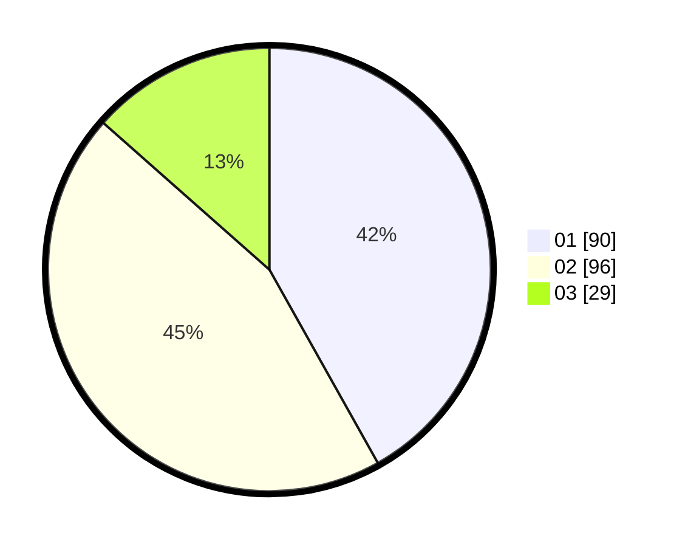

# Hasil

Hasil perolehan suara paslon dapat dilihat pada file paslon-01.txt, paslon-02.txt, dan paslon-03.txt.

Jika tidak ada, artinya data tersebut belum ada pada SIREKAP.

## Perolehan Suara

 * Paslon 01: **90**.
 * Paslon 02: **96**.
 * Paslon 03: **29**.

## Foto C Plano

https://sirekap-obj-formc.kpu.go.id/f795/pemilu/ppwp/31/75/08/10/03/3175081003117-20240214-155559--689210a2-0b7a-442f-9db6-2f7ccc7db201.jpg

https://sirekap-obj-formc.kpu.go.id/f795/pemilu/ppwp/31/75/08/10/03/3175081003117-20240214-193434--88e26c5f-68a6-4da1-9c87-56941420e040.jpg

https://sirekap-obj-formc.kpu.go.id/f795/pemilu/ppwp/31/75/08/10/03/3175081003117-20240214-193558--4af64ba7-4d9a-4e9c-830f-0f6b4c858036.jpg
