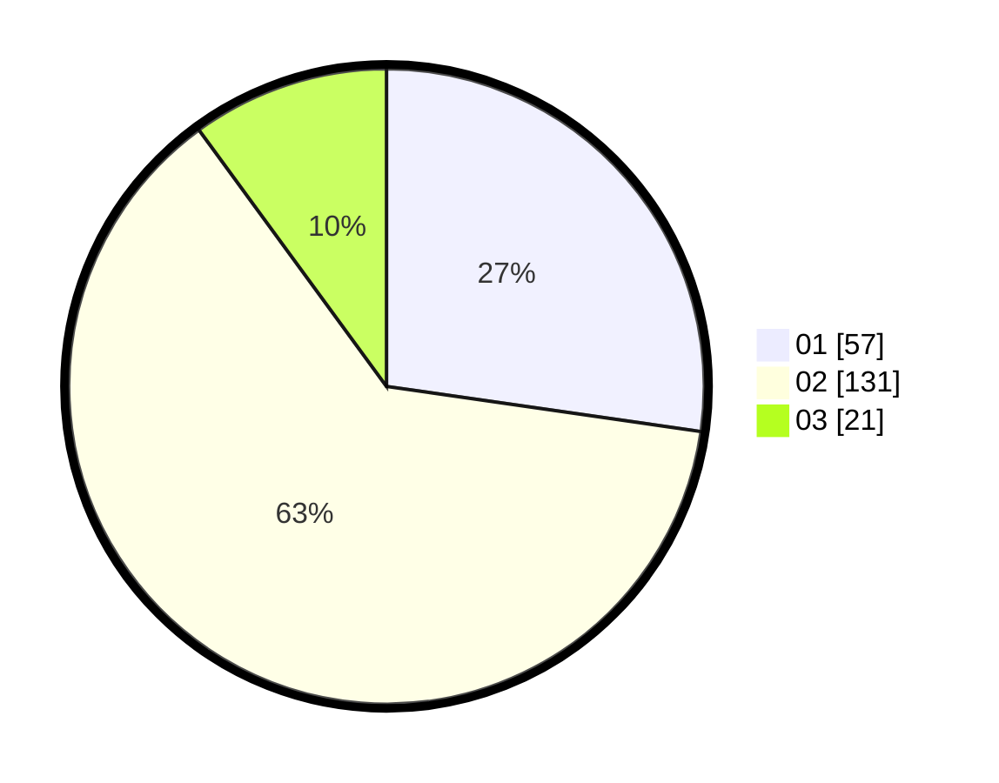

# Hasil

Hasil perolehan suara paslon dapat dilihat pada file paslon-01.txt, paslon-02.txt, dan paslon-03.txt.

Jika tidak ada, artinya data tersebut belum ada pada SIREKAP.

## Perolehan Suara

 * Paslon 01: **57**.
 * Paslon 02: **131**.
 * Paslon 03: **21**.

## Foto C Plano

https://sirekap-obj-formc.kpu.go.id/9632/pemilu/ppwp/31/75/08/10/03/3175081003129-20240214-191211--5c153ac6-b497-4462-9ca1-7cd1b9510043.jpg

https://sirekap-obj-formc.kpu.go.id/9632/pemilu/ppwp/31/75/08/10/03/3175081003129-20240214-192914--47032009-926a-4697-80d8-c71b34814a85.jpg

https://sirekap-obj-formc.kpu.go.id/9632/pemilu/ppwp/31/75/08/10/03/3175081003129-20240214-191516--3a1e1cd8-fc6a-4ae1-8467-0ab77be099dc.jpg

## DATA PEMILIH TETAP

Jumlah pemilih dalam DPT: **259**.
 * L: **143**.
 * P: **116**.

## DATA PENGGUNA HAK PILIH

Jumlah pengguna hak pilih dalam DPT: **214**.
 * L: **112**.
 * P: **102**.

Jumlah pengguna hak pilih dalam DPTb: **2**.
 * L: **1**.
 * P: **1**.

Jumlah pengguna hak pilih dalam DPK: **0**.
 * L: **0**.
 * P: **0**.

Jumlah pengguna hak pilih: **216**.
 * L: **113**.
 * P: **103**.

## JUMLAH SUARA SAH DAN TIDAK SAH

JUMLAH SELURUH SUARA SAH: **209**.

JUMLAH SUARA TIDAK SAH: **7**.

JUMLAH SELURUH SUARA SAH DAN SUARA TIDAK SAH: **216**.
