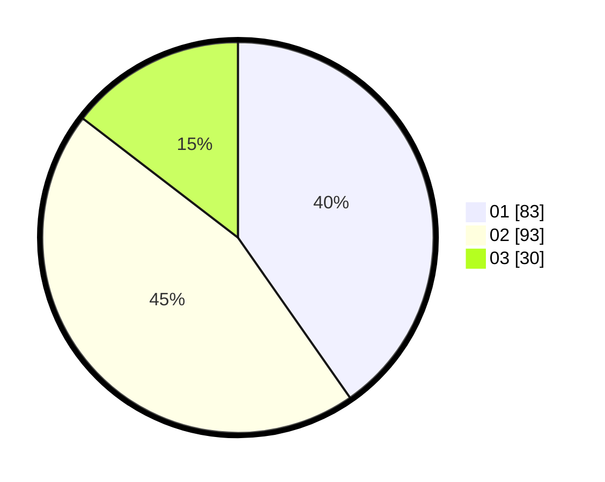

# Hasil

Hasil perolehan suara paslon dapat dilihat pada file paslon-01.txt, paslon-02.txt, dan paslon-03.txt.

Jika tidak ada, artinya data tersebut belum ada pada SIREKAP.

## Perolehan Suara

 * Paslon 01: **83**.
 * Paslon 02: **93**.
 * Paslon 03: **30**.

## Foto C Plano

https://sirekap-obj-formc.kpu.go.id/6f9b/pemilu/ppwp/31/75/08/10/03/3175081003131-20240214-193247--72cf7093-0d42-4580-b8bb-88d8156f4bfb.jpg

https://sirekap-obj-formc.kpu.go.id/6f9b/pemilu/ppwp/31/75/08/10/03/3175081003131-20240214-193310--95877a9e-8438-4d0e-8050-8557cf2dc2e3.jpg

https://sirekap-obj-formc.kpu.go.id/6f9b/pemilu/ppwp/31/75/08/10/03/3175081003131-20240214-194230--2c622cdb-4db9-4a25-89b6-b0c08d1e0887.jpg

## DATA PEMILIH TETAP

Jumlah pemilih dalam DPT: **258**.
 * L: **120**.
 * P: **138**.

## DATA PENGGUNA HAK PILIH

Jumlah pengguna hak pilih dalam DPT: **203**.
 * L: **90**.
 * P: **113**.

Jumlah pengguna hak pilih dalam DPTb: **1**.
 * L: **1**.
 * P: **0**.

Jumlah pengguna hak pilih dalam DPK: **5**.
 * L: **3**.
 * P: **2**.

Jumlah pengguna hak pilih: **209**.
 * L: **94**.
 * P: **115**.

## JUMLAH SUARA SAH DAN TIDAK SAH

JUMLAH SELURUH SUARA SAH: **206**.

JUMLAH SUARA TIDAK SAH: **3**.

JUMLAH SELURUH SUARA SAH DAN SUARA TIDAK SAH: **209**.
