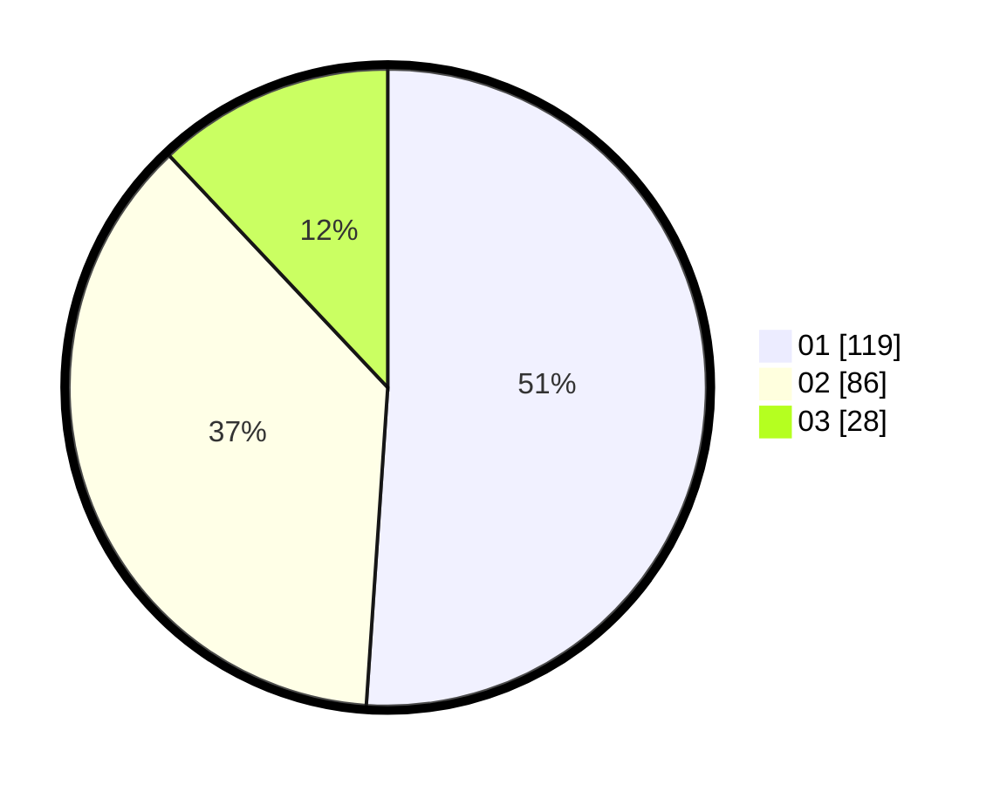

# Hasil

Hasil perolehan suara paslon dapat dilihat pada file paslon-01.txt, paslon-02.txt, dan paslon-03.txt.

Jika tidak ada, artinya data tersebut belum ada pada SIREKAP.

## Perolehan Suara

 * Paslon 01: **119**.
 * Paslon 02: **86**.
 * Paslon 03: **28**.

## Foto C Plano

https://sirekap-obj-formc.kpu.go.id/e3c9/pemilu/ppwp/31/75/08/10/03/3175081003132-20240218-175022--cd998608-c694-4a9d-89ea-856bea886103.jpg

https://sirekap-obj-formc.kpu.go.id/e3c9/pemilu/ppwp/31/75/08/10/03/3175081003132-20240218-175214--1e0d6613-9613-41ff-a256-7acba921b2c1.jpg

https://sirekap-obj-formc.kpu.go.id/e3c9/pemilu/ppwp/31/75/08/10/03/3175081003132-20240218-175343--bd556979-9dbe-417c-850c-ea14dd0a9ade.jpg

## DATA PEMILIH TETAP

Jumlah pemilih dalam DPT: **271**.
 * L: **133**.
 * P: **138**.

## DATA PENGGUNA HAK PILIH

Jumlah pengguna hak pilih dalam DPT: **235**.
 * L: **112**.
 * P: **123**.

Jumlah pengguna hak pilih dalam DPTb: **0**.
 * L: **0**.
 * P: **0**.

Jumlah pengguna hak pilih dalam DPK: **0**.
 * L: **0**.
 * P: **0**.

Jumlah pengguna hak pilih: **235**.
 * L: **112**.
 * P: **123**.

## JUMLAH SUARA SAH DAN TIDAK SAH

JUMLAH SELURUH SUARA SAH: **233**.

JUMLAH SUARA TIDAK SAH: **2**.

JUMLAH SELURUH SUARA SAH DAN SUARA TIDAK SAH: **235**.
