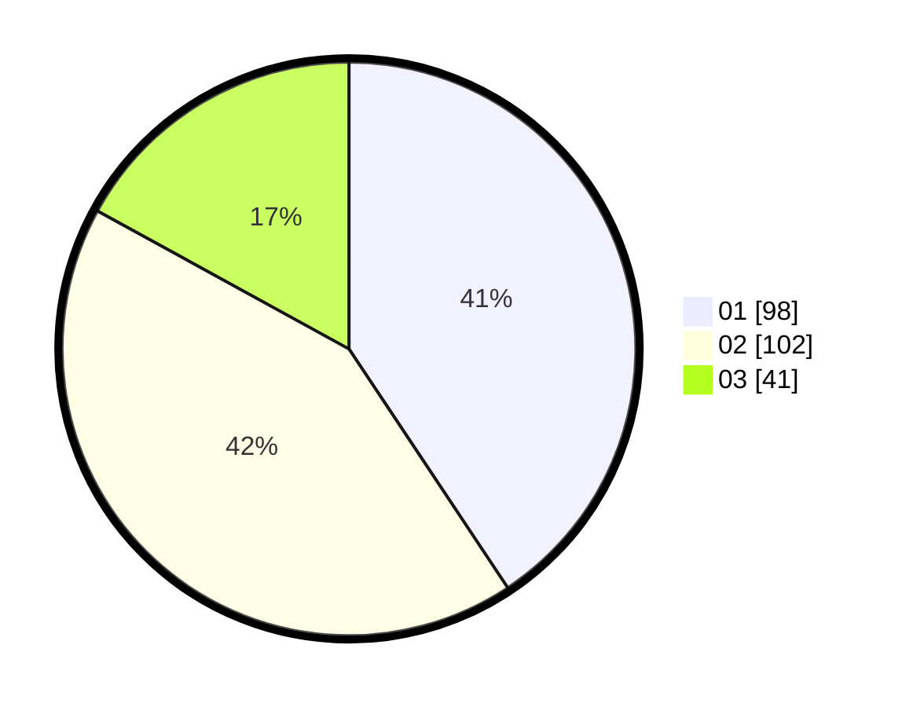

# Hasil

Hasil perolehan suara paslon dapat dilihat pada file paslon-01.txt, paslon-02.txt, dan paslon-03.txt.

Jika tidak ada, artinya data tersebut belum ada pada SIREKAP.

## Perolehan Suara

 * Paslon 01: **98**.
 * Paslon 02: **102**.
 * Paslon 03: **41**.

## Foto C Plano

https://sirekap-obj-formc.kpu.go.id/03b3/pemilu/ppwp/31/75/08/10/03/3175081003135-20240214-155020--d7a4ef15-a489-4636-99ad-f33c429f83d0.jpg

https://sirekap-obj-formc.kpu.go.id/03b3/pemilu/ppwp/31/75/08/10/03/3175081003135-20240214-155432--f9f26d85-f16d-42d5-a037-9415d1a9a26d.jpg

https://sirekap-obj-formc.kpu.go.id/03b3/pemilu/ppwp/31/75/08/10/03/3175081003135-20240214-155757--0ae12e29-5a54-4eaa-8e39-0a12e3bb2252.jpg
