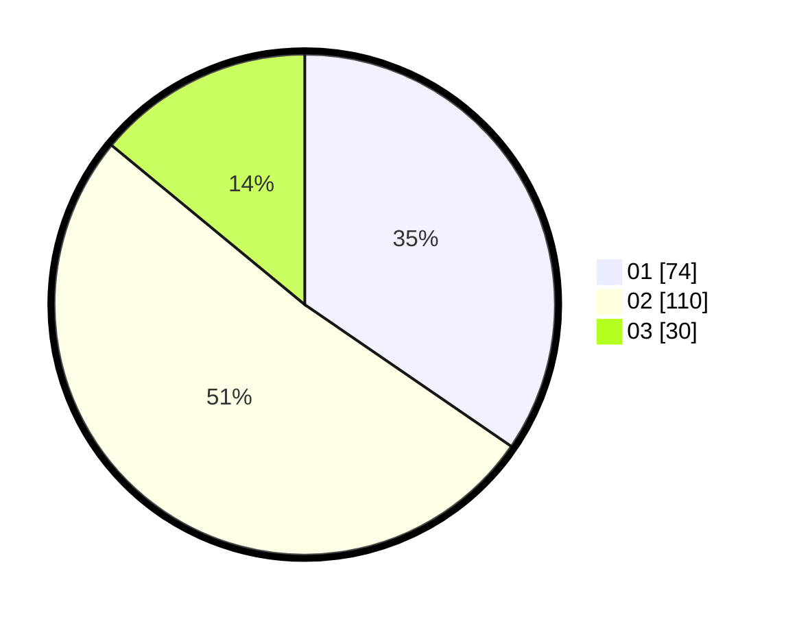

# Hasil

Hasil perolehan suara paslon dapat dilihat pada file paslon-01.txt, paslon-02.txt, dan paslon-03.txt.

Jika tidak ada, artinya data tersebut belum ada pada SIREKAP.

## Perolehan Suara

 * Paslon 01: **74**.
 * Paslon 02: **110**.
 * Paslon 03: **30**.

## Foto C Plano

https://sirekap-obj-formc.kpu.go.id/777b/pemilu/ppwp/31/75/08/10/03/3175081003145-20240215-024801--837617f0-eb11-40e9-a4c7-023e3eef67ee.jpg

https://sirekap-obj-formc.kpu.go.id/777b/pemilu/ppwp/31/75/08/10/03/3175081003145-20240215-024838--3492baf8-e832-4684-aacf-eaa5c33ed797.jpg

https://sirekap-obj-formc.kpu.go.id/777b/pemilu/ppwp/31/75/08/10/03/3175081003145-20240215-024927--fc67655b-87fa-4eb8-9e35-7a2b9b817791.jpg
