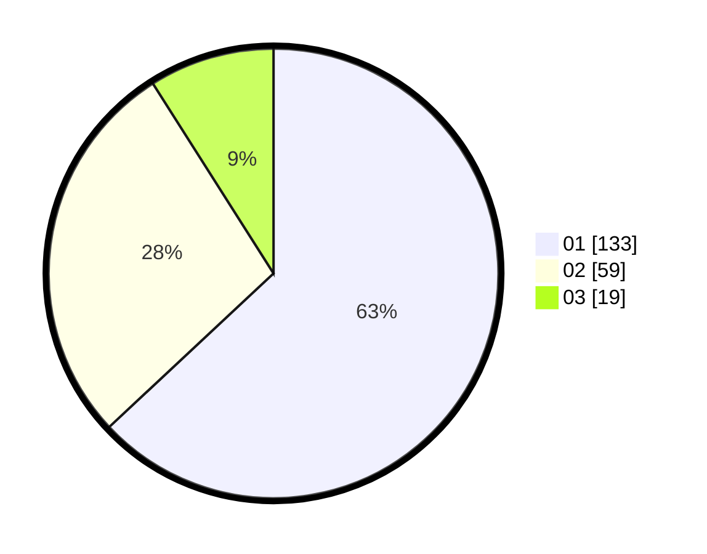

# Hasil

Hasil perolehan suara paslon dapat dilihat pada file paslon-01.txt, paslon-02.txt, dan paslon-03.txt.

Jika tidak ada, artinya data tersebut belum ada pada SIREKAP.

## Perolehan Suara

 * Paslon 01: **133**.
 * Paslon 02: **59**.
 * Paslon 03: **19**.

## Foto C Plano

https://sirekap-obj-formc.kpu.go.id/7478/pemilu/ppwp/31/75/08/10/03/3175081003150-20240214-155652--8f9d3a67-1006-47cf-8334-a32877dda269.jpg

https://sirekap-obj-formc.kpu.go.id/7478/pemilu/ppwp/31/75/08/10/03/3175081003150-20240214-155523--04d98624-ad9e-4316-9272-b4b2b973323d.jpg

https://sirekap-obj-formc.kpu.go.id/7478/pemilu/ppwp/31/75/08/10/03/3175081003150-20240214-160155--7f24886e-48f6-4eb6-baba-24a31ee29529.jpg
