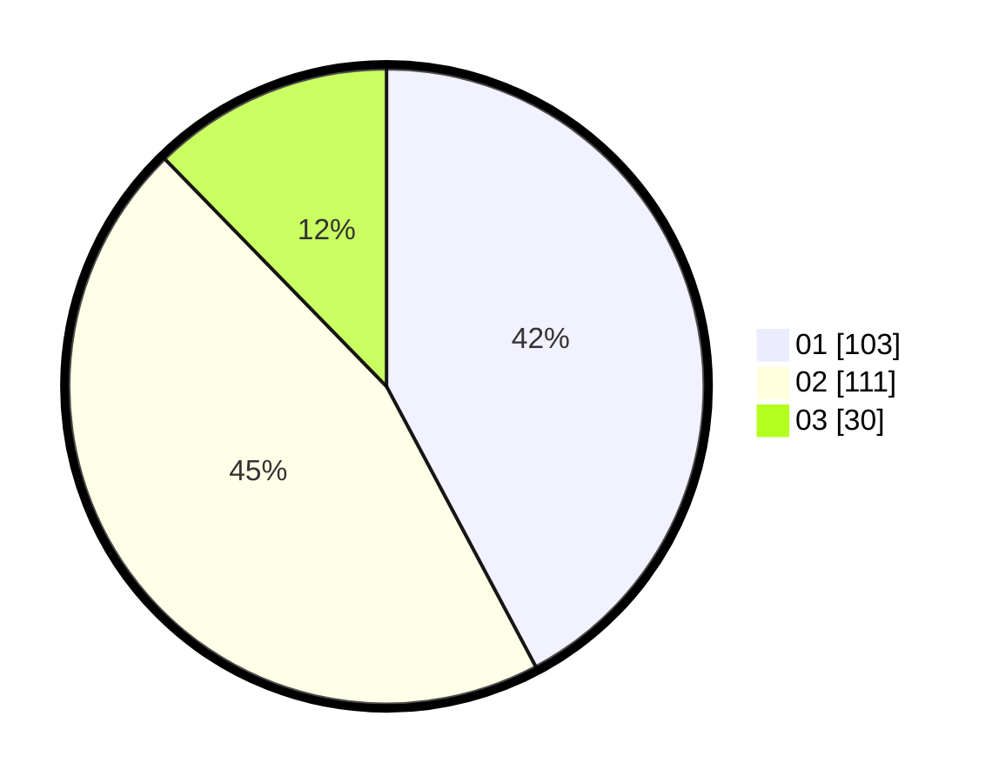

# Hasil

Hasil perolehan suara paslon dapat dilihat pada file paslon-01.txt, paslon-02.txt, dan paslon-03.txt.

Jika tidak ada, artinya data tersebut belum ada pada SIREKAP.

## Perolehan Suara

 * Paslon 01: **103**.
 * Paslon 02: **111**.
 * Paslon 03: **30**.

## Foto C Plano

https://sirekap-obj-formc.kpu.go.id/4ca6/pemilu/ppwp/31/75/08/10/03/3175081003153-20240215-180735--f46fcd2f-8169-4de3-a505-5f1ab0a96fa6.jpg

https://sirekap-obj-formc.kpu.go.id/4ca6/pemilu/ppwp/31/75/08/10/03/3175081003153-20240215-180756--c2713b7b-4937-4296-8d94-88ae13d9db6f.jpg

https://sirekap-obj-formc.kpu.go.id/4ca6/pemilu/ppwp/31/75/08/10/03/3175081003153-20240215-180746--7d8d16c6-54f6-43cd-89be-f10fa06214dc.jpg

## DATA PEMILIH TETAP

Jumlah pemilih dalam DPT: **291**.
 * L: **145**.
 * P: **146**.

## DATA PENGGUNA HAK PILIH

Jumlah pengguna hak pilih dalam DPT: **244**.
 * L: **120**.
 * P: **124**.

Jumlah pengguna hak pilih dalam DPTb: **1**.
 * L: **0**.
 * P: **1**.

Jumlah pengguna hak pilih dalam DPK: **1**.
 * L: **1**.
 * P: **0**.

Jumlah pengguna hak pilih: **246**.
 * L: **121**.
 * P: **125**.

## JUMLAH SUARA SAH DAN TIDAK SAH

JUMLAH SELURUH SUARA SAH: **244**.

JUMLAH SUARA TIDAK SAH: **2**.

JUMLAH SELURUH SUARA SAH DAN SUARA TIDAK SAH: **246**.
