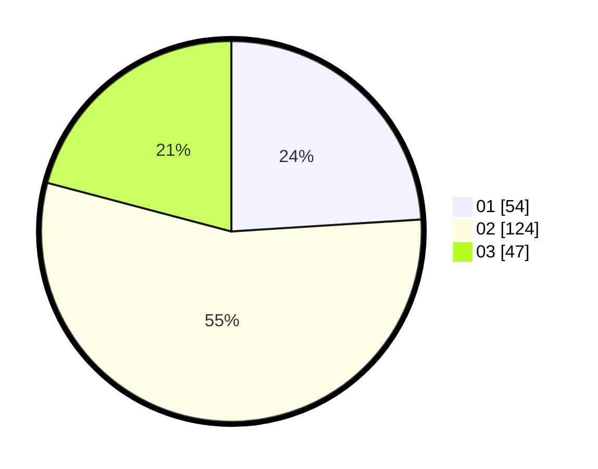

# Hasil

Hasil perolehan suara paslon dapat dilihat pada file paslon-01.txt, paslon-02.txt, dan paslon-03.txt.

Jika tidak ada, artinya data tersebut belum ada pada SIREKAP.

## Perolehan Suara

 * Paslon 01: **54**.
 * Paslon 02: **124**.
 * Paslon 03: **47**.

## Foto C Plano

https://sirekap-obj-formc.kpu.go.id/a42f/pemilu/ppwp/31/75/08/10/03/3175081003155-20240214-155205--7bf947b9-3f77-4ae2-8cb7-49083c645c70.jpg

https://sirekap-obj-formc.kpu.go.id/a42f/pemilu/ppwp/31/75/08/10/03/3175081003155-20240214-155210--b1c77771-c07f-431a-973c-3ba7ccf99bd3.jpg

https://sirekap-obj-formc.kpu.go.id/a42f/pemilu/ppwp/31/75/08/10/03/3175081003155-20240214-155214--28294f55-8a5f-48e0-8ffc-b127c7d36215.jpg

## DATA PEMILIH TETAP

Jumlah pemilih dalam DPT: **289**.
 * L: **139**.
 * P: **150**.

## DATA PENGGUNA HAK PILIH

Jumlah pengguna hak pilih dalam DPT: **255**.
 * L: **104**.
 * P: **121**.

Jumlah pengguna hak pilih dalam DPTb: **0**.
 * L: **0**.
 * P: **0**.

Jumlah pengguna hak pilih dalam DPK: **3**.
 * L: **1**.
 * P: **2**.

Jumlah pengguna hak pilih: **228**.
 * L: **105**.
 * P: **123**.

## JUMLAH SUARA SAH DAN TIDAK SAH

JUMLAH SELURUH SUARA SAH: **225**.

JUMLAH SUARA TIDAK SAH: **3**.

JUMLAH SELURUH SUARA SAH DAN SUARA TIDAK SAH: **228**.
