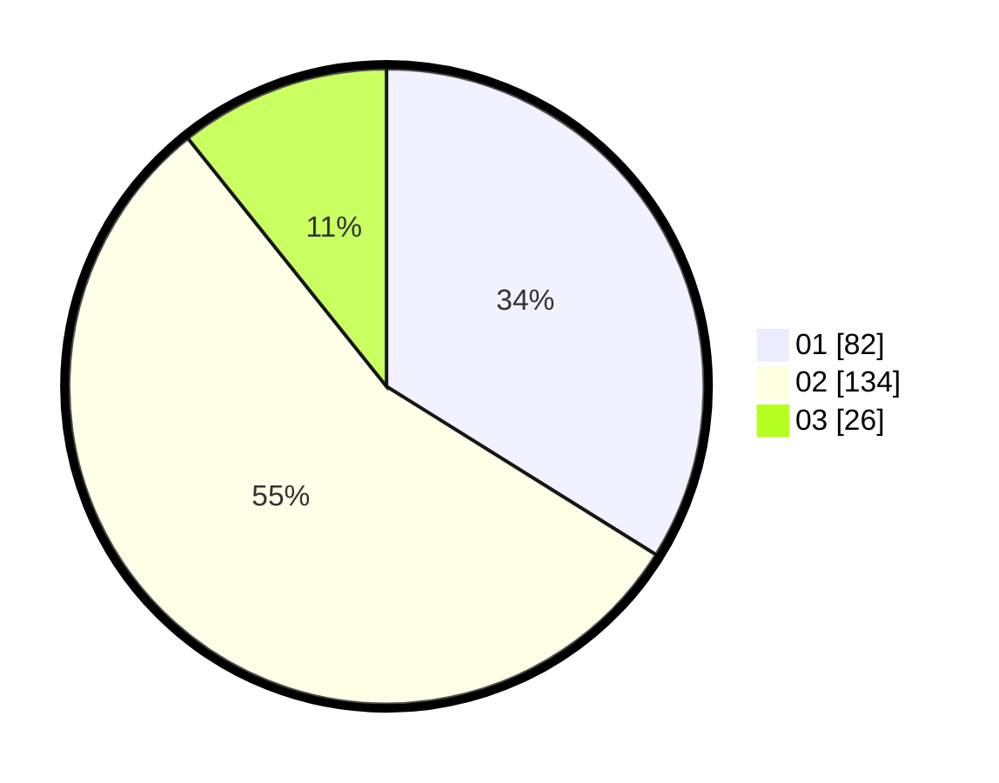

# Hasil

Hasil perolehan suara paslon dapat dilihat pada file paslon-01.txt, paslon-02.txt, dan paslon-03.txt.

Jika tidak ada, artinya data tersebut belum ada pada SIREKAP.

## Perolehan Suara

 * Paslon 01: **82**.
 * Paslon 02: **134**.
 * Paslon 03: **26**.

## Foto C Plano

https://sirekap-obj-formc.kpu.go.id/55db/pemilu/ppwp/31/75/08/10/04/3175081004004-20240215-125315--7c5b9a52-3db3-490c-bae2-d0999c1d9634.jpg

https://sirekap-obj-formc.kpu.go.id/55db/pemilu/ppwp/31/75/08/10/04/3175081004004-20240215-124340--61446120-f6fc-4bb1-8e6f-ed744c384365.jpg

https://sirekap-obj-formc.kpu.go.id/55db/pemilu/ppwp/31/75/08/10/04/3175081004004-20240215-125621--9289a427-23a3-4059-9d58-8249ade23512.jpg
