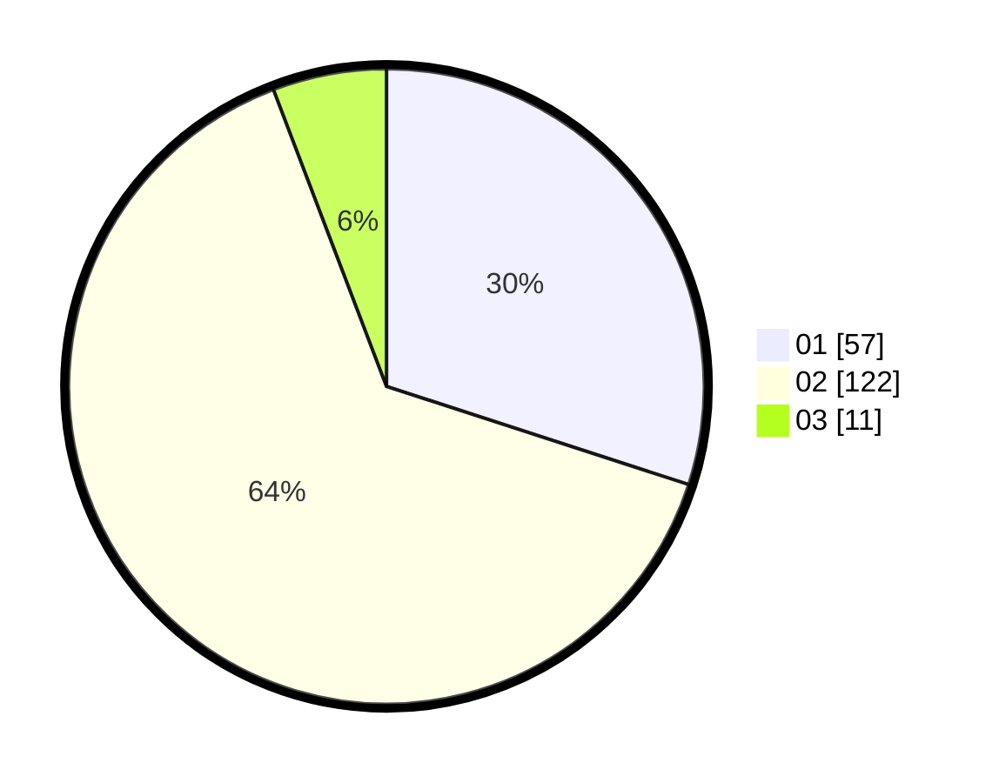

# Hasil

Hasil perolehan suara paslon dapat dilihat pada file paslon-01.txt, paslon-02.txt, dan paslon-03.txt.

Jika tidak ada, artinya data tersebut belum ada pada SIREKAP.

## Perolehan Suara

 * Paslon 01: **57**.
 * Paslon 02: **122**.
 * Paslon 03: **11**.

## Foto C Plano

https://sirekap-obj-formc.kpu.go.id/3314/pemilu/ppwp/31/75/08/10/04/3175081004007-20240214-201708--75621376-6e49-4783-bb3a-46d828257f8e.jpg

https://sirekap-obj-formc.kpu.go.id/3314/pemilu/ppwp/31/75/08/10/04/3175081004007-20240214-213955--1e78c329-1d6e-4f6e-b3f1-d12ba8061907.jpg

https://sirekap-obj-formc.kpu.go.id/3314/pemilu/ppwp/31/75/08/10/04/3175081004007-20240214-201354--7d8d4e93-ea4d-4aa3-b006-e4595a34d674.jpg

## DATA PEMILIH TETAP

Jumlah pemilih dalam DPT: **252**.
 * L: **70**.
 * P: **182**.

## DATA PENGGUNA HAK PILIH

Jumlah pengguna hak pilih dalam DPT: **191**.
 * L: **52**.
 * P: **139**.

Jumlah pengguna hak pilih dalam DPTb: **0**.
 * L: **0**.
 * P: **0**.

Jumlah pengguna hak pilih dalam DPK: **0**.
 * L: **0**.
 * P: **0**.

Jumlah pengguna hak pilih: **191**.
 * L: **52**.
 * P: **139**.

## JUMLAH SUARA SAH DAN TIDAK SAH

JUMLAH SELURUH SUARA SAH: **190**.

JUMLAH SUARA TIDAK SAH: **1**.

JUMLAH SELURUH SUARA SAH DAN SUARA TIDAK SAH: **191**.
