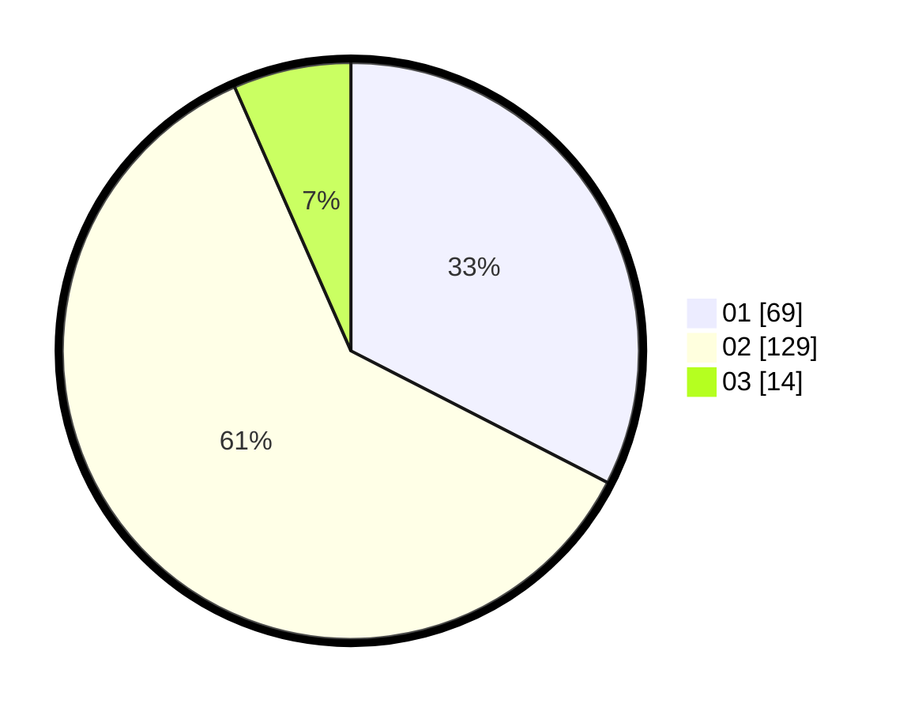

# Hasil

Hasil perolehan suara paslon dapat dilihat pada file paslon-01.txt, paslon-02.txt, dan paslon-03.txt.

Jika tidak ada, artinya data tersebut belum ada pada SIREKAP.

## Perolehan Suara

 * Paslon 01: **69**.
 * Paslon 02: **129**.
 * Paslon 03: **14**.

## Foto C Plano

https://sirekap-obj-formc.kpu.go.id/2c34/pemilu/ppwp/31/75/08/10/04/3175081004008-20240216-134417--f8890d5f-dabf-41a0-a68c-1ee0f3c8e25b.jpg

https://sirekap-obj-formc.kpu.go.id/2c34/pemilu/ppwp/31/75/08/10/04/3175081004008-20240216-134419--92432229-83e2-4515-99f4-565b98472bc8.jpg

https://sirekap-obj-formc.kpu.go.id/2c34/pemilu/ppwp/31/75/08/10/04/3175081004008-20240216-134418--49a30c92-2218-4771-ac5e-8db9067f7d0b.jpg

## DATA PEMILIH TETAP

Jumlah pemilih dalam DPT: **257**.
 * L: **76**.
 * P: **181**.

## DATA PENGGUNA HAK PILIH

Jumlah pengguna hak pilih dalam DPT: **207**.
 * L: **51**.
 * P: **156**.

Jumlah pengguna hak pilih dalam DPTb: **6**.
 * L: **3**.
 * P: **3**.

Jumlah pengguna hak pilih dalam DPK: **1**.
 * L: **1**.
 * P: **0**.

Jumlah pengguna hak pilih: **214**.
 * L: **55**.
 * P: **159**.

## JUMLAH SUARA SAH DAN TIDAK SAH

JUMLAH SELURUH SUARA SAH: **212**.

JUMLAH SUARA TIDAK SAH: **2**.

JUMLAH SELURUH SUARA SAH DAN SUARA TIDAK SAH: **214**.
