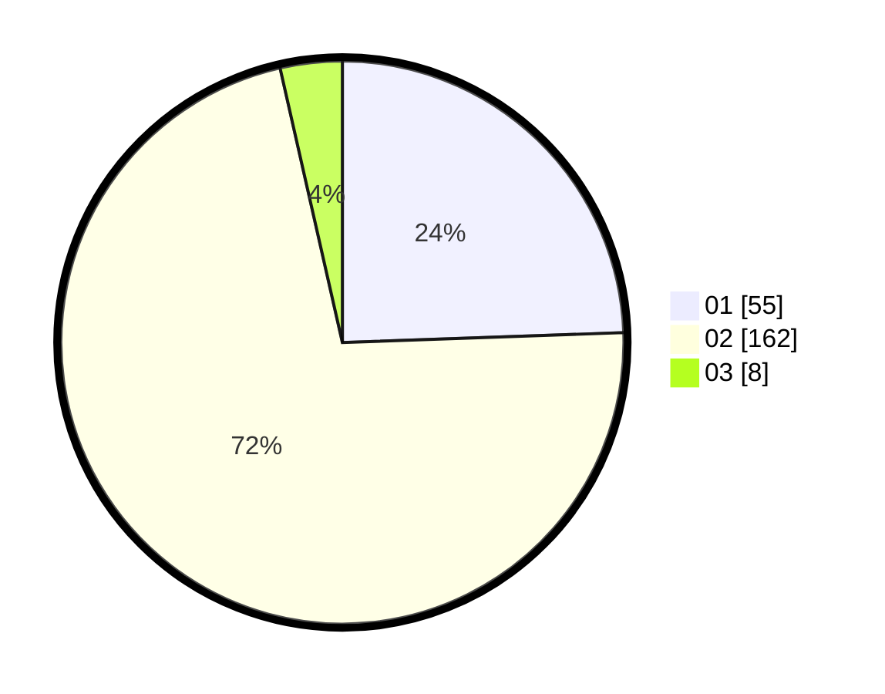

# Hasil

Hasil perolehan suara paslon dapat dilihat pada file paslon-01.txt, paslon-02.txt, dan paslon-03.txt.

Jika tidak ada, artinya data tersebut belum ada pada SIREKAP.

## Perolehan Suara

 * Paslon 01: **55**.
 * Paslon 02: **162**.
 * Paslon 03: **8**.

## Foto C Plano

https://sirekap-obj-formc.kpu.go.id/a7b0/pemilu/ppwp/31/75/08/10/04/3175081004009-20240214-233537--4a9a89c4-ef52-4b81-9815-a1841df2bbb1.jpg

https://sirekap-obj-formc.kpu.go.id/a7b0/pemilu/ppwp/31/75/08/10/04/3175081004009-20240214-234832--6413af58-77e5-496b-988b-85192939f6d3.jpg

https://sirekap-obj-formc.kpu.go.id/a7b0/pemilu/ppwp/31/75/08/10/04/3175081004009-20240214-235047--39999b8b-2131-44a1-9836-f1336e697a58.jpg
