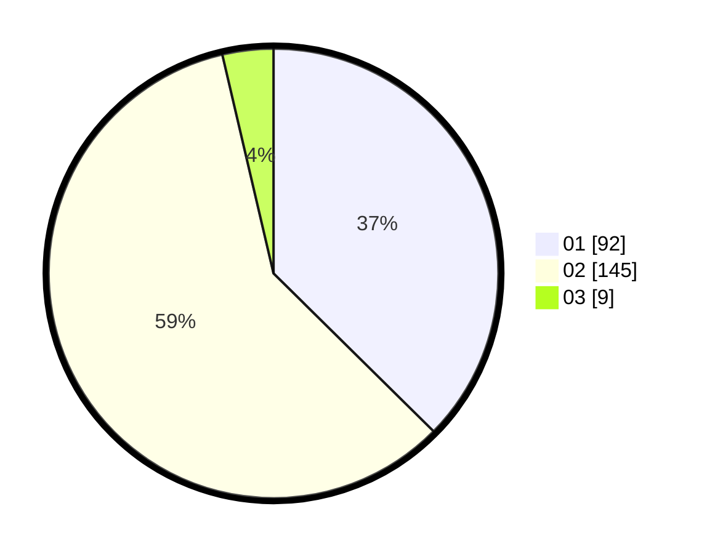

# Hasil

Hasil perolehan suara paslon dapat dilihat pada file paslon-01.txt, paslon-02.txt, dan paslon-03.txt.

Jika tidak ada, artinya data tersebut belum ada pada SIREKAP.

## Perolehan Suara

 * Paslon 01: **92**.
 * Paslon 02: **145**.
 * Paslon 03: **9**.

## Foto C Plano

https://sirekap-obj-formc.kpu.go.id/039d/pemilu/ppwp/31/75/08/10/04/3175081004012-20240216-023438--44340a22-809f-49d0-a35b-0651400f4567.jpg

https://sirekap-obj-formc.kpu.go.id/039d/pemilu/ppwp/31/75/08/10/04/3175081004012-20240216-023446--0b402b7a-e39f-45ad-a82a-9825861c25e3.jpg

https://sirekap-obj-formc.kpu.go.id/039d/pemilu/ppwp/31/75/08/10/04/3175081004012-20240216-023439--41f9d1e3-87f2-4d00-985a-15ab283348e1.jpg

## DATA PEMILIH TETAP

Jumlah pemilih dalam DPT: **284**.
 * L: **88**.
 * P: **196**.

## DATA PENGGUNA HAK PILIH

Jumlah pengguna hak pilih dalam DPT: **246**.
 * L: **72**.
 * P: **174**.

Jumlah pengguna hak pilih dalam DPTb: **1**.
 * L: **0**.
 * P: **1**.

Jumlah pengguna hak pilih dalam DPK: **1**.
 * L: **1**.
 * P: **0**.

Jumlah pengguna hak pilih: **248**.
 * L: **73**.
 * P: **175**.

## JUMLAH SUARA SAH DAN TIDAK SAH

JUMLAH SELURUH SUARA SAH: **246**.

JUMLAH SUARA TIDAK SAH: **2**.

JUMLAH SELURUH SUARA SAH DAN SUARA TIDAK SAH: **248**.
