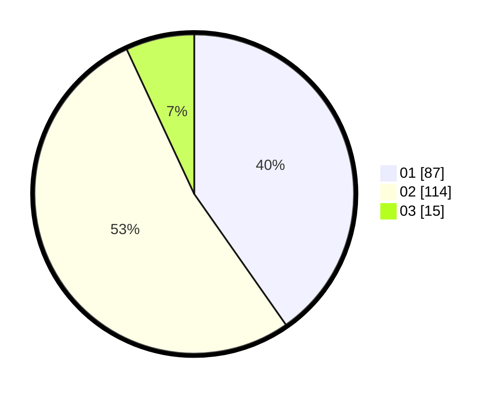

# Hasil

Hasil perolehan suara paslon dapat dilihat pada file paslon-01.txt, paslon-02.txt, dan paslon-03.txt.

Jika tidak ada, artinya data tersebut belum ada pada SIREKAP.

## Perolehan Suara

 * Paslon 01: **87**.
 * Paslon 02: **114**.
 * Paslon 03: **15**.

## Foto C Plano

https://sirekap-obj-formc.kpu.go.id/750d/pemilu/ppwp/31/75/08/10/04/3175081004014-20240216-153310--9f1b5087-e883-4b5d-9bdc-20c77bfa0e2f.jpg

https://sirekap-obj-formc.kpu.go.id/750d/pemilu/ppwp/31/75/08/10/04/3175081004014-20240216-153311--ed331806-302d-46db-a218-b05bbdcc812b.jpg

https://sirekap-obj-formc.kpu.go.id/750d/pemilu/ppwp/31/75/08/10/04/3175081004014-20240216-153310--69fa8396-a38c-4166-a210-c281efd97a0d.jpg

## DATA PEMILIH TETAP

Jumlah pemilih dalam DPT: **254**.
 * L: **96**.
 * P: **158**.

## DATA PENGGUNA HAK PILIH

Jumlah pengguna hak pilih dalam DPT: **254**.
 * L: **96**.
 * P: **158**.

Jumlah pengguna hak pilih dalam DPTb: **2**.
 * L: **0**.
 * P: **2**.

Jumlah pengguna hak pilih dalam DPK: **2**.
 * L: **1**.
 * P: **1**.

Jumlah pengguna hak pilih: **258**.
 * L: **97**.
 * P: **161**.

## JUMLAH SUARA SAH DAN TIDAK SAH

JUMLAH SELURUH SUARA SAH: **216**.

JUMLAH SUARA TIDAK SAH: **1**.

JUMLAH SELURUH SUARA SAH DAN SUARA TIDAK SAH: **217**.
