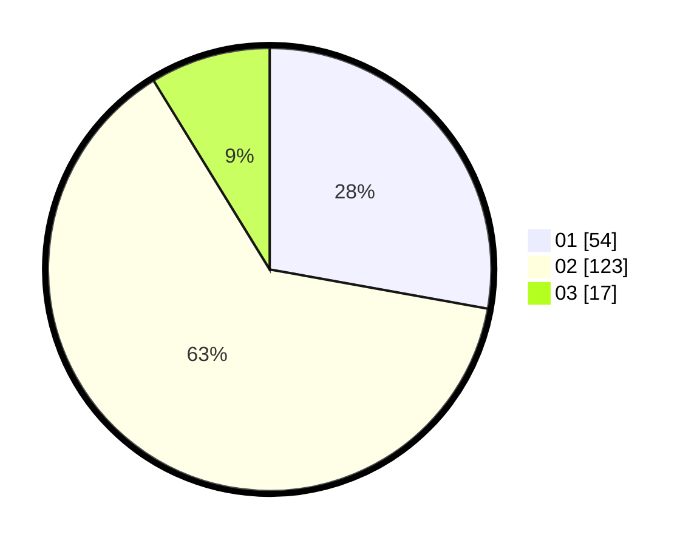

# Hasil

Hasil perolehan suara paslon dapat dilihat pada file paslon-01.txt, paslon-02.txt, dan paslon-03.txt.

Jika tidak ada, artinya data tersebut belum ada pada SIREKAP.

## Perolehan Suara

 * Paslon 01: **54**.
 * Paslon 02: **123**.
 * Paslon 03: **17**.

## Foto C Plano

https://sirekap-obj-formc.kpu.go.id/2513/pemilu/ppwp/31/75/08/10/04/3175081004020-20240214-193234--a84f18cf-9ff3-43fb-b914-326c8b66bf60.jpg

https://sirekap-obj-formc.kpu.go.id/2513/pemilu/ppwp/31/75/08/10/04/3175081004020-20240214-192151--a2cf9f0d-516d-43b8-97d8-dc820bbd0e66.jpg

https://sirekap-obj-formc.kpu.go.id/2513/pemilu/ppwp/31/75/08/10/04/3175081004020-20240214-191932--a0e207f8-1113-4c5e-ab68-808a2ccb5b44.jpg

## DATA PEMILIH TETAP

Jumlah pemilih dalam DPT: **248**.
 * L: **81**.
 * P: **167**.

## DATA PENGGUNA HAK PILIH

Jumlah pengguna hak pilih dalam DPT: **188**.
 * L: **53**.
 * P: **135**.

Jumlah pengguna hak pilih dalam DPTb: **0**.
 * L: **1**.
 * P: **0**.

Jumlah pengguna hak pilih dalam DPK: **6**.
 * L: **4**.
 * P: **2**.

Jumlah pengguna hak pilih: **195**.
 * L: **58**.
 * P: **137**.

## JUMLAH SUARA SAH DAN TIDAK SAH

JUMLAH SELURUH SUARA SAH: **194**.

JUMLAH SUARA TIDAK SAH: **1**.

JUMLAH SELURUH SUARA SAH DAN SUARA TIDAK SAH: **195**.
