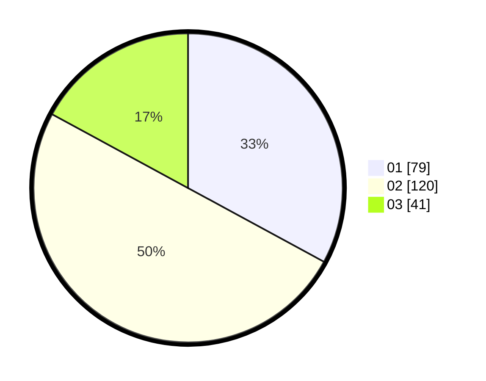

# Hasil

Hasil perolehan suara paslon dapat dilihat pada file paslon-01.txt, paslon-02.txt, dan paslon-03.txt.

Jika tidak ada, artinya data tersebut belum ada pada SIREKAP.

## Perolehan Suara

 * Paslon 01: **79**.
 * Paslon 02: **120**.
 * Paslon 03: **41**.

## Foto C Plano

https://sirekap-obj-formc.kpu.go.id/17d7/pemilu/ppwp/31/75/08/10/04/3175081004023-20240214-203316--96063a1f-f900-4de3-934e-9b9381c04a9e.jpg

https://sirekap-obj-formc.kpu.go.id/17d7/pemilu/ppwp/31/75/08/10/04/3175081004023-20240214-203511--424c3363-291a-441c-a251-19fd101c7bd4.jpg

https://sirekap-obj-formc.kpu.go.id/17d7/pemilu/ppwp/31/75/08/10/04/3175081004023-20240214-203624--fe5ee1fa-f9d2-4b77-b76d-7e7542c58333.jpg
