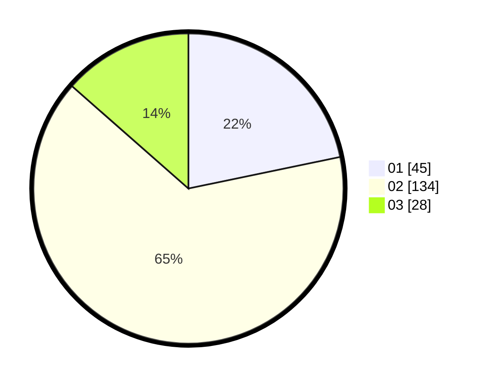

# Hasil

Hasil perolehan suara paslon dapat dilihat pada file paslon-01.txt, paslon-02.txt, dan paslon-03.txt.

Jika tidak ada, artinya data tersebut belum ada pada SIREKAP.

## Perolehan Suara

 * Paslon 01: **45**.
 * Paslon 02: **134**.
 * Paslon 03: **28**.

## Foto C Plano

https://sirekap-obj-formc.kpu.go.id/72f7/pemilu/ppwp/31/75/08/10/04/3175081004024-20240216-141849--43c9e5bd-d397-4acf-a23c-3724785b1e5d.jpg

https://sirekap-obj-formc.kpu.go.id/72f7/pemilu/ppwp/31/75/08/10/04/3175081004024-20240216-141850--960a7b59-e4d9-452f-ba47-6405b4f43b12.jpg

https://sirekap-obj-formc.kpu.go.id/72f7/pemilu/ppwp/31/75/08/10/04/3175081004024-20240216-141850--88216c1f-2524-43e1-9dc7-2b02795bd43e.jpg

## DATA PEMILIH TETAP

Jumlah pemilih dalam DPT: **265**.
 * L: **123**.
 * P: **142**.

## DATA PENGGUNA HAK PILIH

Jumlah pengguna hak pilih dalam DPT: **208**.
 * L: **90**.
 * P: **118**.

Jumlah pengguna hak pilih dalam DPTb: **1**.
 * L: **1**.
 * P: **0**.

Jumlah pengguna hak pilih dalam DPK: **3**.
 * L: **2**.
 * P: **1**.

Jumlah pengguna hak pilih: **212**.
 * L: **93**.
 * P: **119**.

## JUMLAH SUARA SAH DAN TIDAK SAH

JUMLAH SELURUH SUARA SAH: **207**.

JUMLAH SUARA TIDAK SAH: **5**.

JUMLAH SELURUH SUARA SAH DAN SUARA TIDAK SAH: **212**.
