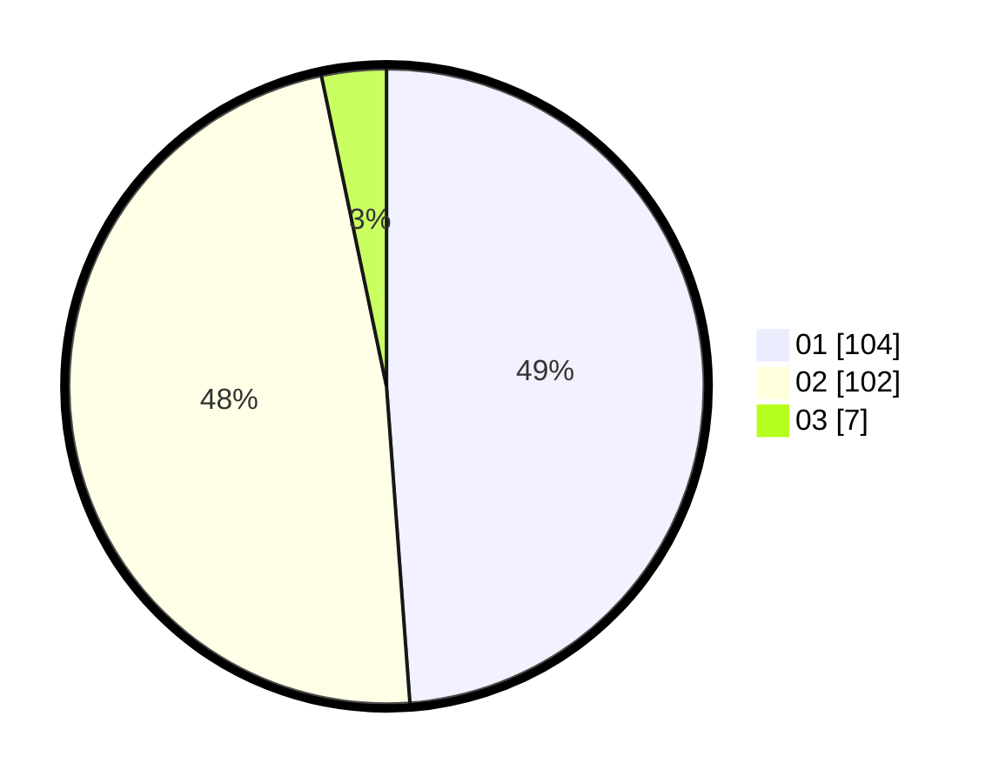

# Hasil

Hasil perolehan suara paslon dapat dilihat pada file paslon-01.txt, paslon-02.txt, dan paslon-03.txt.

Jika tidak ada, artinya data tersebut belum ada pada SIREKAP.

## Perolehan Suara

 * Paslon 01: **104**.
 * Paslon 02: **102**.
 * Paslon 03: **7**.

## Foto C Plano

https://sirekap-obj-formc.kpu.go.id/a797/pemilu/ppwp/31/75/08/10/04/3175081004030-20240214-224743--dc632632-aa45-4bcf-b07b-80ed4616df95.jpg

https://sirekap-obj-formc.kpu.go.id/a797/pemilu/ppwp/31/75/08/10/04/3175081004030-20240214-224849--4e9f46af-05cb-437c-ba14-e29f97dc87df.jpg
