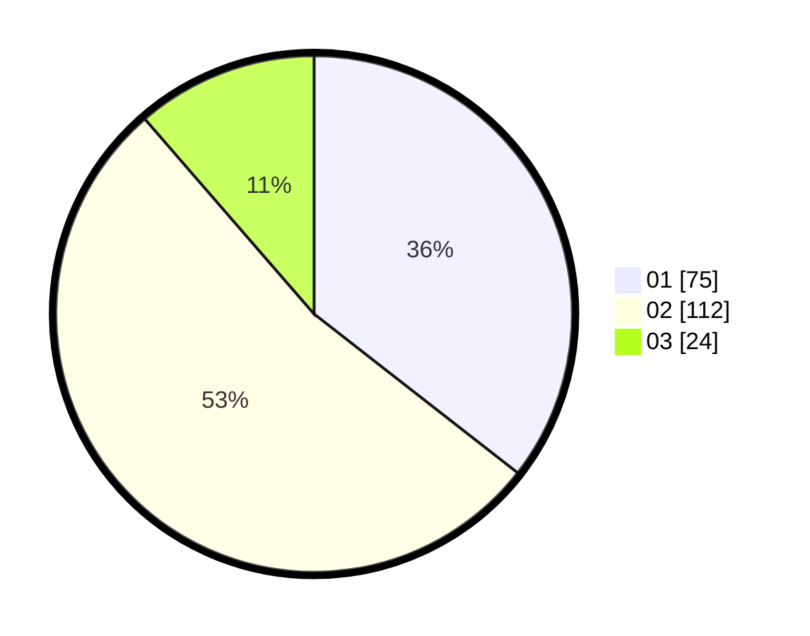

# Hasil

Hasil perolehan suara paslon dapat dilihat pada file paslon-01.txt, paslon-02.txt, dan paslon-03.txt.

Jika tidak ada, artinya data tersebut belum ada pada SIREKAP.

## Perolehan Suara

 * Paslon 01: **75**.
 * Paslon 02: **112**.
 * Paslon 03: **24**.

## Foto C Plano

https://sirekap-obj-formc.kpu.go.id/bfbf/pemilu/ppwp/31/75/08/10/04/3175081004031-20240214-232940--6de53110-21b2-4ad4-8bf9-8a8a3b2492d4.jpg

https://sirekap-obj-formc.kpu.go.id/bfbf/pemilu/ppwp/31/75/08/10/04/3175081004031-20240214-232953--f0a217c3-6166-491e-897a-83e2665be7df.jpg

https://sirekap-obj-formc.kpu.go.id/bfbf/pemilu/ppwp/31/75/08/10/04/3175081004031-20240214-233044--3452ceca-e723-42bb-8594-ce044060584d.jpg
