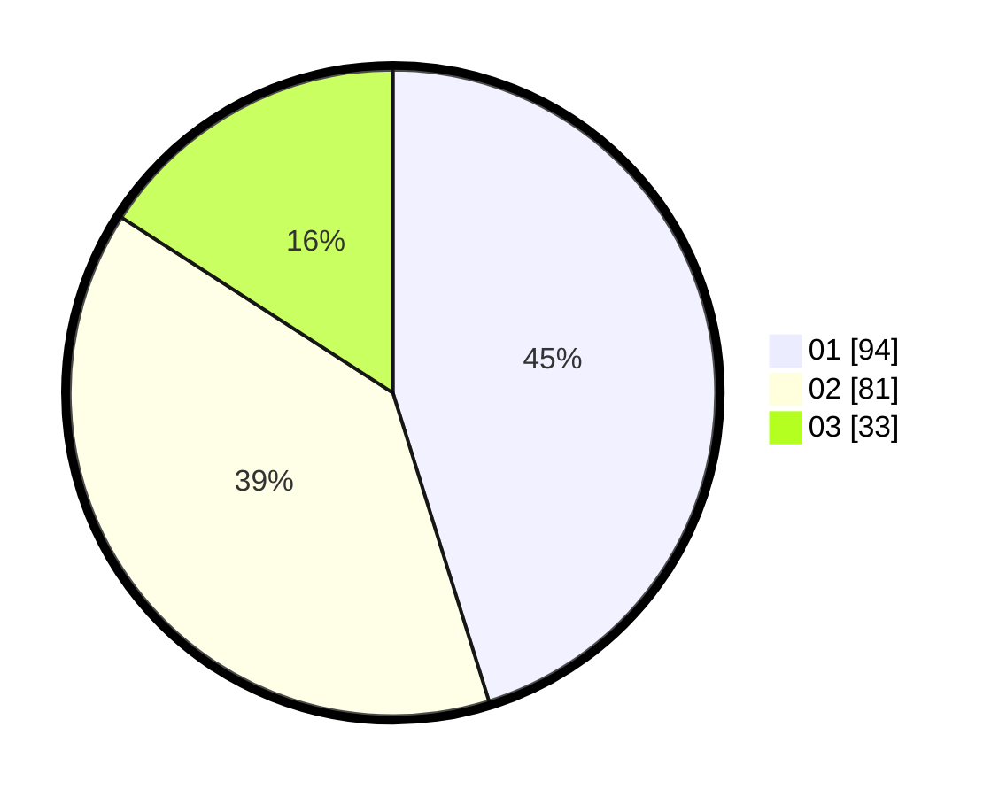

# Hasil

Hasil perolehan suara paslon dapat dilihat pada file paslon-01.txt, paslon-02.txt, dan paslon-03.txt.

Jika tidak ada, artinya data tersebut belum ada pada SIREKAP.

## Perolehan Suara

 * Paslon 01: **94**.
 * Paslon 02: **81**.
 * Paslon 03: **33**.

## Foto C Plano

https://sirekap-obj-formc.kpu.go.id/0fc0/pemilu/ppwp/31/75/08/10/04/3175081004032-20240216-080734--6a438a24-1b41-4c2d-bf82-0be91a0d76c2.jpg

https://sirekap-obj-formc.kpu.go.id/0fc0/pemilu/ppwp/31/75/08/10/04/3175081004032-20240216-080747--9efd7ba0-4c71-45bc-92ae-c7c34a7783c0.jpg

https://sirekap-obj-formc.kpu.go.id/0fc0/pemilu/ppwp/31/75/08/10/04/3175081004032-20240216-080740--99c3455b-037c-4e9e-9897-a532fc88900d.jpg

## DATA PEMILIH TETAP

Jumlah pemilih dalam DPT: **259**.
 * L: **135**.
 * P: **124**.

## DATA PENGGUNA HAK PILIH

Jumlah pengguna hak pilih dalam DPT: **210**.
 * L: **103**.
 * P: **107**.

Jumlah pengguna hak pilih dalam DPTb: **0**.
 * L: **0**.
 * P: **0**.

Jumlah pengguna hak pilih dalam DPK: **0**.
 * L: **0**.
 * P: **0**.

Jumlah pengguna hak pilih: **210**.
 * L: **103**.
 * P: **107**.

## JUMLAH SUARA SAH DAN TIDAK SAH

JUMLAH SELURUH SUARA SAH: **208**.

JUMLAH SUARA TIDAK SAH: **2**.

JUMLAH SELURUH SUARA SAH DAN SUARA TIDAK SAH: **210**.
