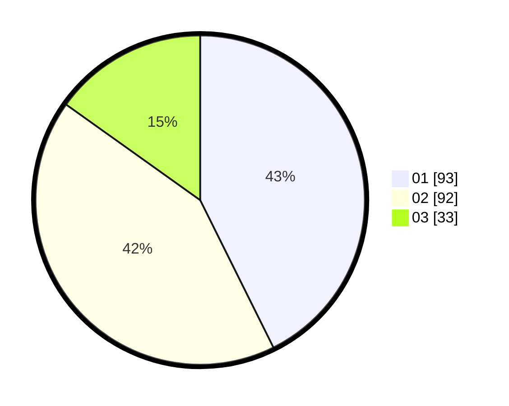

# Hasil

Hasil perolehan suara paslon dapat dilihat pada file paslon-01.txt, paslon-02.txt, dan paslon-03.txt.

Jika tidak ada, artinya data tersebut belum ada pada SIREKAP.

## Perolehan Suara

 * Paslon 01: **93**.
 * Paslon 02: **92**.
 * Paslon 03: **33**.

## Foto C Plano

https://sirekap-obj-formc.kpu.go.id/8d99/pemilu/ppwp/31/75/08/10/04/3175081004043-20240214-234022--ad185948-ebcb-4231-b234-1f72f89e35e5.jpg

https://sirekap-obj-formc.kpu.go.id/8d99/pemilu/ppwp/31/75/08/10/04/3175081004043-20240214-234116--ec4d5f5b-92de-4c17-a8a1-654d34b84c88.jpg

https://sirekap-obj-formc.kpu.go.id/8d99/pemilu/ppwp/31/75/08/10/04/3175081004043-20240214-205356--91a542fa-1403-4bc0-846c-1f48cd790e02.jpg
