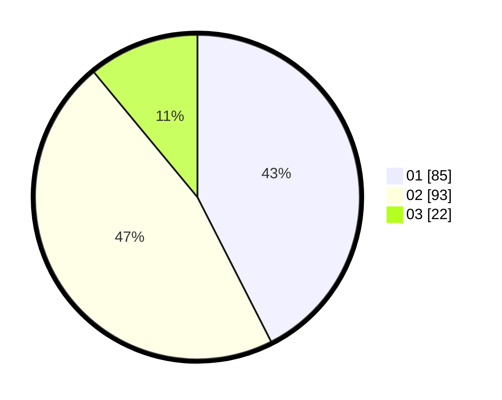

# Hasil

Hasil perolehan suara paslon dapat dilihat pada file paslon-01.txt, paslon-02.txt, dan paslon-03.txt.

Jika tidak ada, artinya data tersebut belum ada pada SIREKAP.

## Perolehan Suara

 * Paslon 01: **85**.
 * Paslon 02: **93**.
 * Paslon 03: **22**.

## Foto C Plano

https://sirekap-obj-formc.kpu.go.id/8441/pemilu/ppwp/31/75/08/10/04/3175081004047-20240214-215947--d9f20bb4-1f41-4884-9be9-7006e210b693.jpg

https://sirekap-obj-formc.kpu.go.id/8441/pemilu/ppwp/31/75/08/10/04/3175081004047-20240214-220051--2d1c4c05-a6d4-4038-bc3c-e8c113cb1023.jpg
