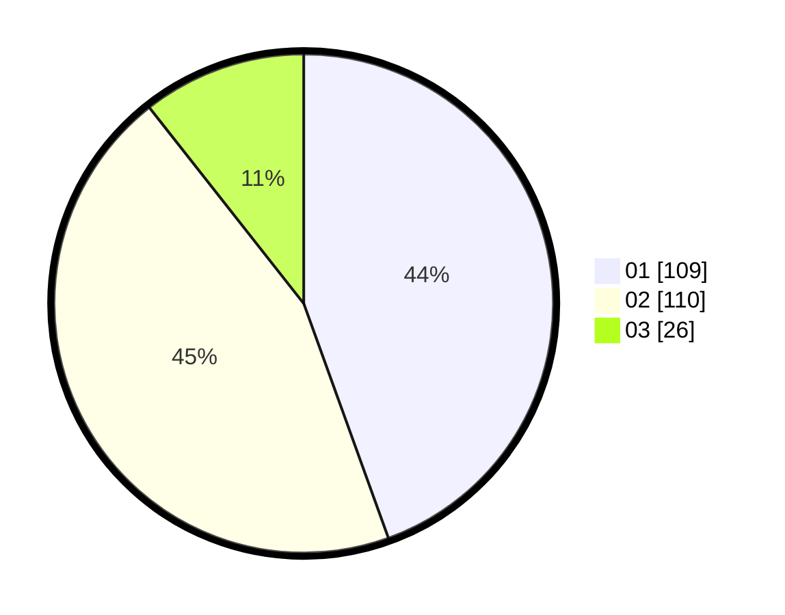

# Hasil

Hasil perolehan suara paslon dapat dilihat pada file paslon-01.txt, paslon-02.txt, dan paslon-03.txt.

Jika tidak ada, artinya data tersebut belum ada pada SIREKAP.

## Perolehan Suara

 * Paslon 01: **109**.
 * Paslon 02: **110**.
 * Paslon 03: **26**.

## Foto C Plano

https://sirekap-obj-formc.kpu.go.id/de27/pemilu/ppwp/31/75/08/10/04/3175081004051-20240215-160800--913ac85d-fe5c-47fd-9e6a-f7965efb92bf.jpg

https://sirekap-obj-formc.kpu.go.id/de27/pemilu/ppwp/31/75/08/10/04/3175081004051-20240215-160818--50114bc9-8bfa-4a48-929a-6139c0e8c1f7.jpg

https://sirekap-obj-formc.kpu.go.id/de27/pemilu/ppwp/31/75/08/10/04/3175081004051-20240215-160812--9dd74788-e26d-4399-86e1-424fb2a24fbf.jpg
