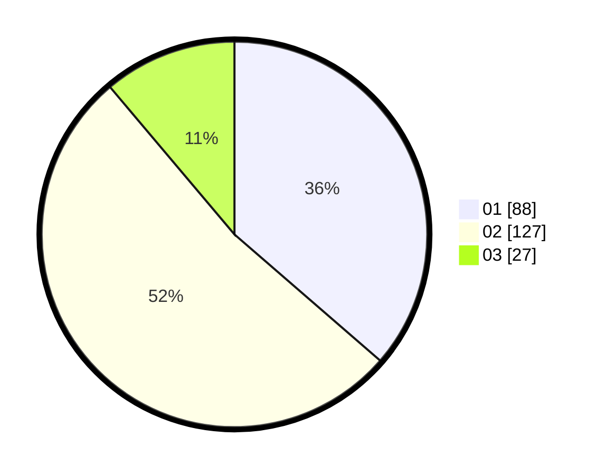

# Hasil

Hasil perolehan suara paslon dapat dilihat pada file paslon-01.txt, paslon-02.txt, dan paslon-03.txt.

Jika tidak ada, artinya data tersebut belum ada pada SIREKAP.

## Perolehan Suara

 * Paslon 01: **88**.
 * Paslon 02: **127**.
 * Paslon 03: **27**.

## Foto C Plano

https://sirekap-obj-formc.kpu.go.id/bc4e/pemilu/ppwp/31/75/08/10/04/3175081004053-20240214-235521--79d8f8c2-0baa-4ecf-87a5-06432dbfa60c.jpg

https://sirekap-obj-formc.kpu.go.id/bc4e/pemilu/ppwp/31/75/08/10/04/3175081004053-20240214-235627--7deb3d93-ff76-416b-880c-450b9bc440f0.jpg

https://sirekap-obj-formc.kpu.go.id/bc4e/pemilu/ppwp/31/75/08/10/04/3175081004053-20240214-235858--80020c91-dd69-4c6f-8d31-c07b3b726ac3.jpg
