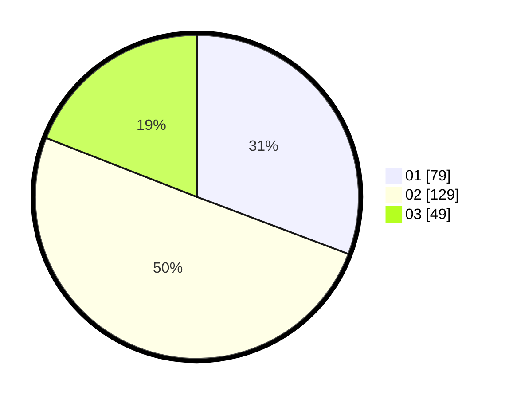

# Hasil

Hasil perolehan suara paslon dapat dilihat pada file paslon-01.txt, paslon-02.txt, dan paslon-03.txt.

Jika tidak ada, artinya data tersebut belum ada pada SIREKAP.

## Perolehan Suara

 * Paslon 01: **79**.
 * Paslon 02: **129**.
 * Paslon 03: **49**.

## Foto C Plano

https://sirekap-obj-formc.kpu.go.id/6f69/pemilu/ppwp/31/75/08/10/04/3175081004054-20240214-225846--f10e80b1-ba1a-46cc-8ac2-862f51ce92bf.jpg

https://sirekap-obj-formc.kpu.go.id/6f69/pemilu/ppwp/31/75/08/10/04/3175081004054-20240214-230019--eb43a124-a583-4786-b691-461585873a95.jpg

https://sirekap-obj-formc.kpu.go.id/6f69/pemilu/ppwp/31/75/08/10/04/3175081004054-20240214-230150--75aa3f3e-bd3f-4104-9078-21b27c4f70d8.jpg
