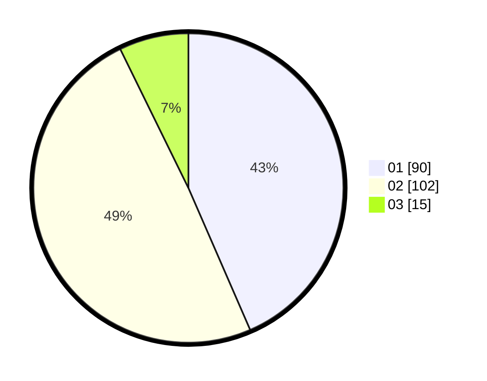

# Hasil

Hasil perolehan suara paslon dapat dilihat pada file paslon-01.txt, paslon-02.txt, dan paslon-03.txt.

Jika tidak ada, artinya data tersebut belum ada pada SIREKAP.

## Perolehan Suara

 * Paslon 01: **90**.
 * Paslon 02: **102**.
 * Paslon 03: **15**.

## Foto C Plano

https://sirekap-obj-formc.kpu.go.id/0eb9/pemilu/ppwp/31/75/08/10/04/3175081004057-20240215-015332--4c6e2913-4873-481e-b49e-96765efa452b.jpg

https://sirekap-obj-formc.kpu.go.id/0eb9/pemilu/ppwp/31/75/08/10/04/3175081004057-20240215-015549--a4278ad0-779b-4c40-b4e0-805c68fd4068.jpg

https://sirekap-obj-formc.kpu.go.id/0eb9/pemilu/ppwp/31/75/08/10/04/3175081004057-20240215-015642--b25db439-dc8c-440b-bbfb-0ca92ce6d035.jpg
