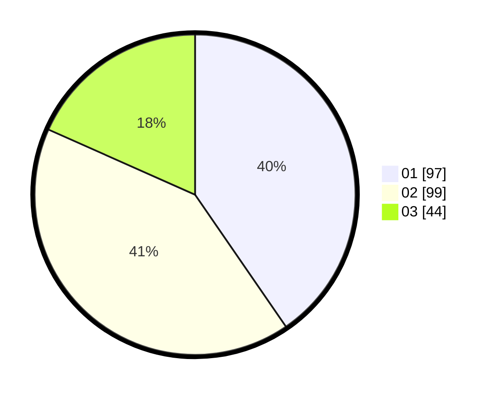

# Hasil

Hasil perolehan suara paslon dapat dilihat pada file paslon-01.txt, paslon-02.txt, dan paslon-03.txt.

Jika tidak ada, artinya data tersebut belum ada pada SIREKAP.

## Perolehan Suara

 * Paslon 01: **97**.
 * Paslon 02: **99**.
 * Paslon 03: **44**.

## Foto C Plano

https://sirekap-obj-formc.kpu.go.id/1314/pemilu/ppwp/31/75/08/10/04/3175081004061-20240215-005811--e0d3d695-7611-4d72-87b9-b1c1195110e8.jpg

https://sirekap-obj-formc.kpu.go.id/1314/pemilu/ppwp/31/75/08/10/04/3175081004061-20240215-005905--14f48d56-90d2-40af-906b-f44b52cd2441.jpg

https://sirekap-obj-formc.kpu.go.id/1314/pemilu/ppwp/31/75/08/10/04/3175081004061-20240215-010015--8e70d955-2738-4fb4-8050-d0a804930325.jpg
