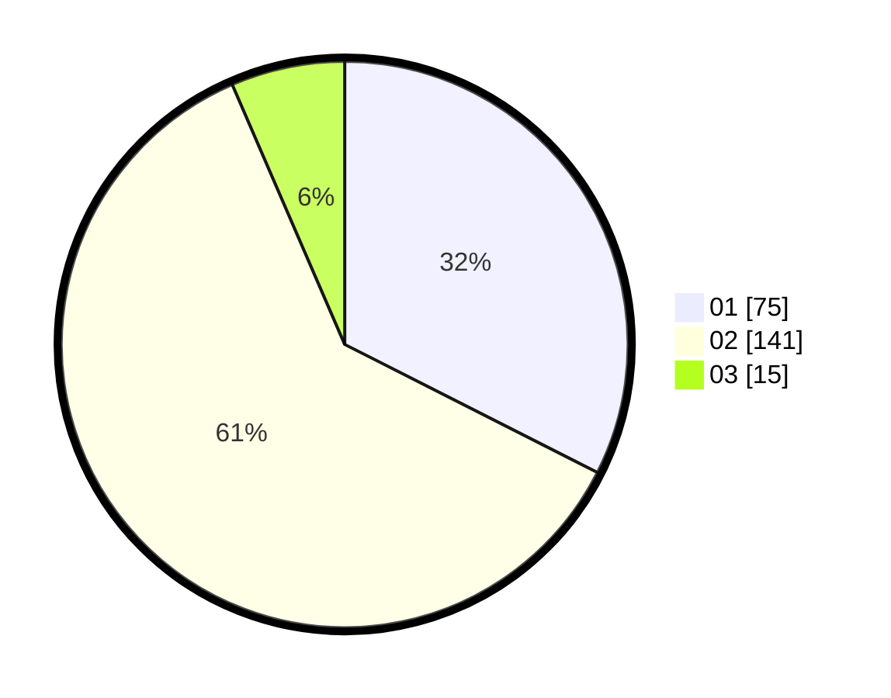

# Hasil

Hasil perolehan suara paslon dapat dilihat pada file paslon-01.txt, paslon-02.txt, dan paslon-03.txt.

Jika tidak ada, artinya data tersebut belum ada pada SIREKAP.

## Perolehan Suara

 * Paslon 01: **75**.
 * Paslon 02: **141**.
 * Paslon 03: **15**.

## Foto C Plano

https://sirekap-obj-formc.kpu.go.id/8864/pemilu/ppwp/31/75/08/10/04/3175081004066-20240215-025144--45a6e987-b49a-4d33-aae1-7d90a8aaaa4c.jpg

https://sirekap-obj-formc.kpu.go.id/8864/pemilu/ppwp/31/75/08/10/04/3175081004066-20240215-030048--3617d536-797c-466e-8e08-cba79b80e958.jpg

https://sirekap-obj-formc.kpu.go.id/8864/pemilu/ppwp/31/75/08/10/04/3175081004066-20240215-025213--6a538742-d060-4578-a077-cef7961911a6.jpg
