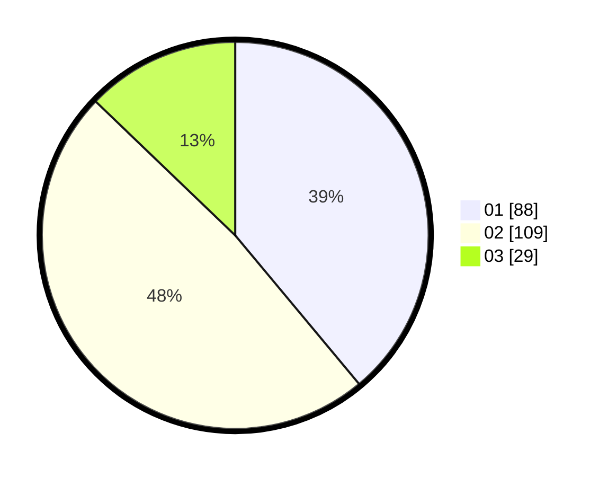

# Hasil

Hasil perolehan suara paslon dapat dilihat pada file paslon-01.txt, paslon-02.txt, dan paslon-03.txt.

Jika tidak ada, artinya data tersebut belum ada pada SIREKAP.

## Perolehan Suara

 * Paslon 01: **88**.
 * Paslon 02: **109**.
 * Paslon 03: **29**.

## Foto C Plano

https://sirekap-obj-formc.kpu.go.id/f0e1/pemilu/ppwp/31/75/08/10/04/3175081004074-20240214-160136--f3468285-3939-420e-bdb9-221cc7ae4a6d.jpg

https://sirekap-obj-formc.kpu.go.id/f0e1/pemilu/ppwp/31/75/08/10/04/3175081004074-20240214-155804--db84e050-8232-4aa1-b788-cac45aa14ffc.jpg

https://sirekap-obj-formc.kpu.go.id/f0e1/pemilu/ppwp/31/75/08/10/04/3175081004074-20240214-160151--ce8d1dda-6c09-4997-b0fc-588d2aed6ba5.jpg
