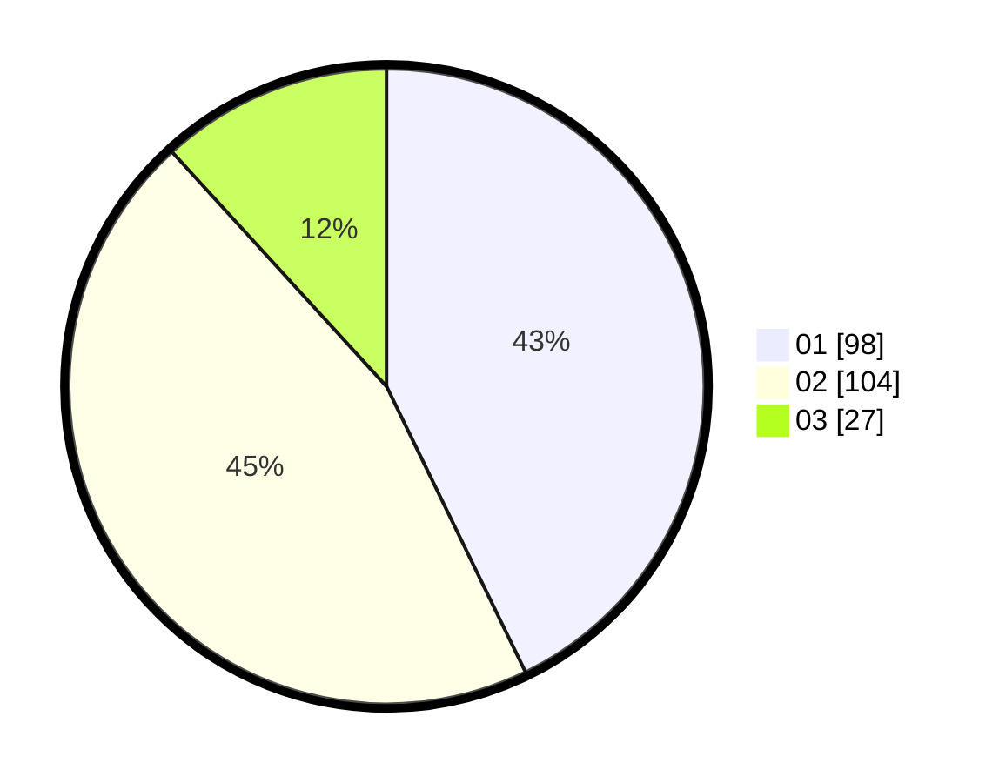

# Hasil

Hasil perolehan suara paslon dapat dilihat pada file paslon-01.txt, paslon-02.txt, dan paslon-03.txt.

Jika tidak ada, artinya data tersebut belum ada pada SIREKAP.

## Perolehan Suara

 * Paslon 01: **98**.
 * Paslon 02: **104**.
 * Paslon 03: **27**.

## Foto C Plano

https://sirekap-obj-formc.kpu.go.id/d961/pemilu/ppwp/31/75/08/10/04/3175081004075-20240214-224412--71b51b37-647a-46ca-aeaa-7c0311e3bf7d.jpg

https://sirekap-obj-formc.kpu.go.id/d961/pemilu/ppwp/31/75/08/10/04/3175081004075-20240214-224426--f938064f-ff44-4e0f-a844-45d2f621b738.jpg

https://sirekap-obj-formc.kpu.go.id/d961/pemilu/ppwp/31/75/08/10/04/3175081004075-20240214-224431--d1c2962e-136c-4039-8e96-5bdd474ad341.jpg
