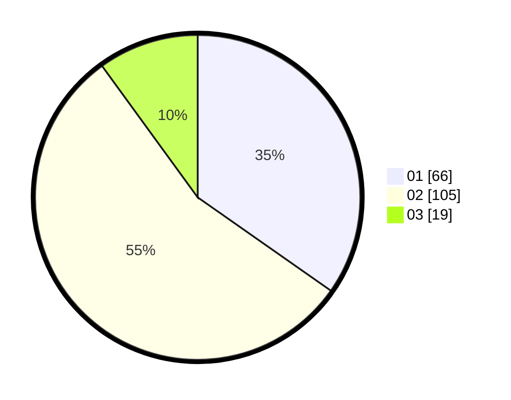

# Hasil

Hasil perolehan suara paslon dapat dilihat pada file paslon-01.txt, paslon-02.txt, dan paslon-03.txt.

Jika tidak ada, artinya data tersebut belum ada pada SIREKAP.

## Perolehan Suara

 * Paslon 01: **66**.
 * Paslon 02: **105**.
 * Paslon 03: **19**.

## Foto C Plano

https://sirekap-obj-formc.kpu.go.id/2e33/pemilu/ppwp/31/75/08/10/04/3175081004076-20240214-215900--e5194fbe-ea21-4c7f-a539-c90ea17108d6.jpg

https://sirekap-obj-formc.kpu.go.id/2e33/pemilu/ppwp/31/75/08/10/04/3175081004076-20240214-231542--810690d0-a17c-409e-99f6-f022a4337211.jpg

https://sirekap-obj-formc.kpu.go.id/2e33/pemilu/ppwp/31/75/08/10/04/3175081004076-20240214-231632--0d374f75-a505-42bc-8319-5f5a56a3ce7f.jpg
