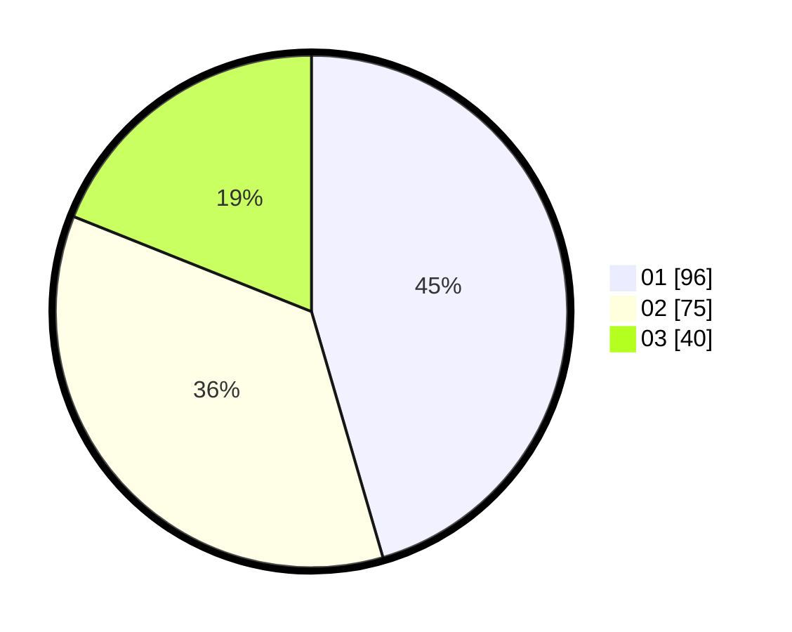

# Hasil

Hasil perolehan suara paslon dapat dilihat pada file paslon-01.txt, paslon-02.txt, dan paslon-03.txt.

Jika tidak ada, artinya data tersebut belum ada pada SIREKAP.

## Perolehan Suara

 * Paslon 01: **96**.
 * Paslon 02: **75**.
 * Paslon 03: **40**.

## Foto C Plano

https://sirekap-obj-formc.kpu.go.id/012b/pemilu/ppwp/31/75/08/10/05/3175081005001-20240216-153951--d0da2525-204d-4ffb-a0e4-79371a76864b.jpg

https://sirekap-obj-formc.kpu.go.id/012b/pemilu/ppwp/31/75/08/10/05/3175081005001-20240214-220800--ab883a01-e9b3-48b9-96a0-90535d53a4ca.jpg
