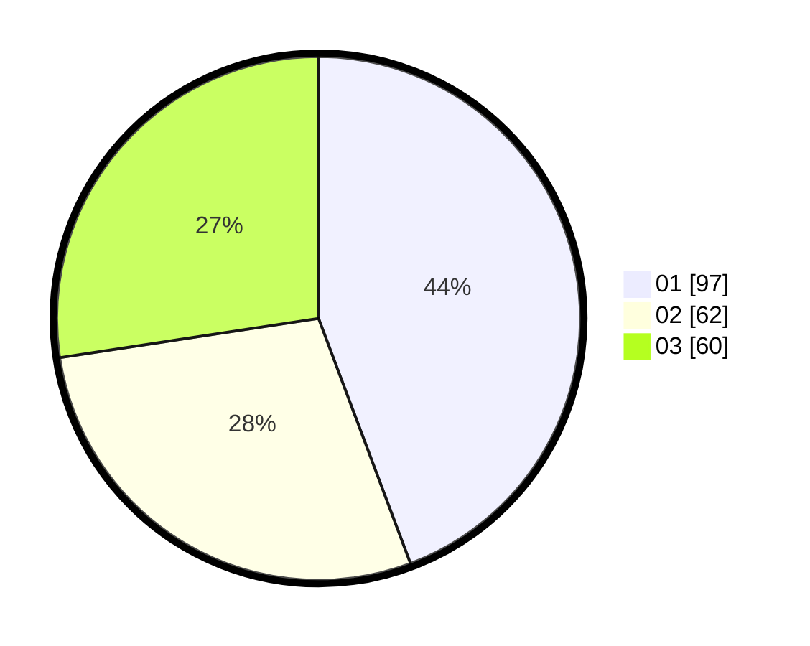

# Hasil

Hasil perolehan suara paslon dapat dilihat pada file paslon-01.txt, paslon-02.txt, dan paslon-03.txt.

Jika tidak ada, artinya data tersebut belum ada pada SIREKAP.

## Perolehan Suara

 * Paslon 01: **97**.
 * Paslon 02: **62**.
 * Paslon 03: **60**.

## Foto C Plano

https://sirekap-obj-formc.kpu.go.id/30d5/pemilu/ppwp/31/75/08/10/05/3175081005002-20240216-120143--7b728cd0-477f-45c5-97ae-4247c621ad2b.jpg

https://sirekap-obj-formc.kpu.go.id/30d5/pemilu/ppwp/31/75/08/10/05/3175081005002-20240216-120144--7fbde172-0eed-407f-88ee-a731e96804fa.jpg

https://sirekap-obj-formc.kpu.go.id/30d5/pemilu/ppwp/31/75/08/10/05/3175081005002-20240216-120144--71560e8a-8ddf-48b0-9eb3-50a5098e9f56.jpg

## DATA PEMILIH TETAP

Jumlah pemilih dalam DPT: **271**.
 * L: **133**.
 * P: **138**.

## DATA PENGGUNA HAK PILIH

Jumlah pengguna hak pilih dalam DPT: **218**.
 * L: **102**.
 * P: **116**.

Jumlah pengguna hak pilih dalam DPTb: **4**.
 * L: **1**.
 * P: **3**.

Jumlah pengguna hak pilih dalam DPK: **0**.
 * L: **0**.
 * P: **0**.

Jumlah pengguna hak pilih: **222**.
 * L: **103**.
 * P: **119**.

## JUMLAH SUARA SAH DAN TIDAK SAH

JUMLAH SELURUH SUARA SAH: **219**.

JUMLAH SUARA TIDAK SAH: **3**.

JUMLAH SELURUH SUARA SAH DAN SUARA TIDAK SAH: **222**.
