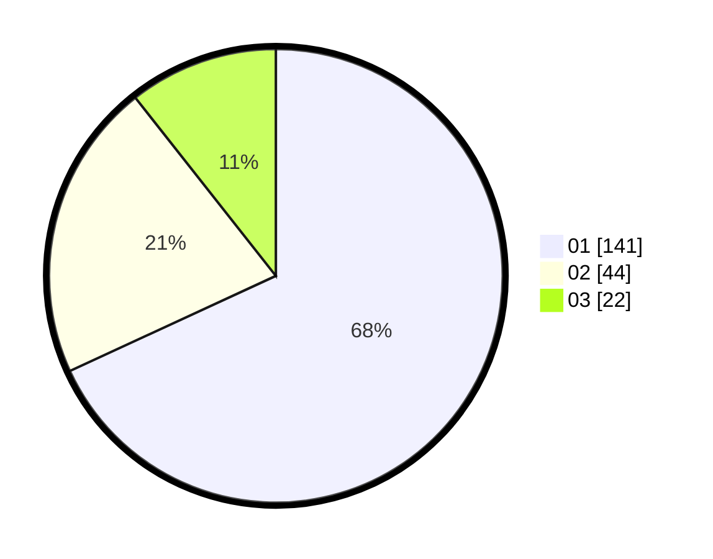

# Hasil

Hasil perolehan suara paslon dapat dilihat pada file paslon-01.txt, paslon-02.txt, dan paslon-03.txt.

Jika tidak ada, artinya data tersebut belum ada pada SIREKAP.

## Perolehan Suara

 * Paslon 01: **141**.
 * Paslon 02: **44**.
 * Paslon 03: **22**.

## Foto C Plano

https://sirekap-obj-formc.kpu.go.id/5592/pemilu/ppwp/31/75/08/10/05/3175081005004-20240216-222303--732397e8-ff25-47af-a2cc-bd4f92639f30.jpg

https://sirekap-obj-formc.kpu.go.id/5592/pemilu/ppwp/31/75/08/10/05/3175081005004-20240216-222507--cd92cca6-36db-4e6c-b53a-bde02fb378aa.jpg

https://sirekap-obj-formc.kpu.go.id/5592/pemilu/ppwp/31/75/08/10/05/3175081005004-20240216-222629--67a23b8d-afb6-4c84-94ca-1c97f1ae0eb9.jpg

## DATA PEMILIH TETAP

Jumlah pemilih dalam DPT: **273**.
 * L: **136**.
 * P: **137**.

## DATA PENGGUNA HAK PILIH

Jumlah pengguna hak pilih dalam DPT: **212**.
 * L: **97**.
 * P: **115**.

Jumlah pengguna hak pilih dalam DPTb: **0**.
 * L: **0**.
 * P: **0**.

Jumlah pengguna hak pilih dalam DPK: **0**.
 * L: **0**.
 * P: **0**.

Jumlah pengguna hak pilih: **212**.
 * L: **97**.
 * P: **115**.

## JUMLAH SUARA SAH DAN TIDAK SAH

JUMLAH SELURUH SUARA SAH: **207**.

JUMLAH SUARA TIDAK SAH: **5**.

JUMLAH SELURUH SUARA SAH DAN SUARA TIDAK SAH: **212**.
