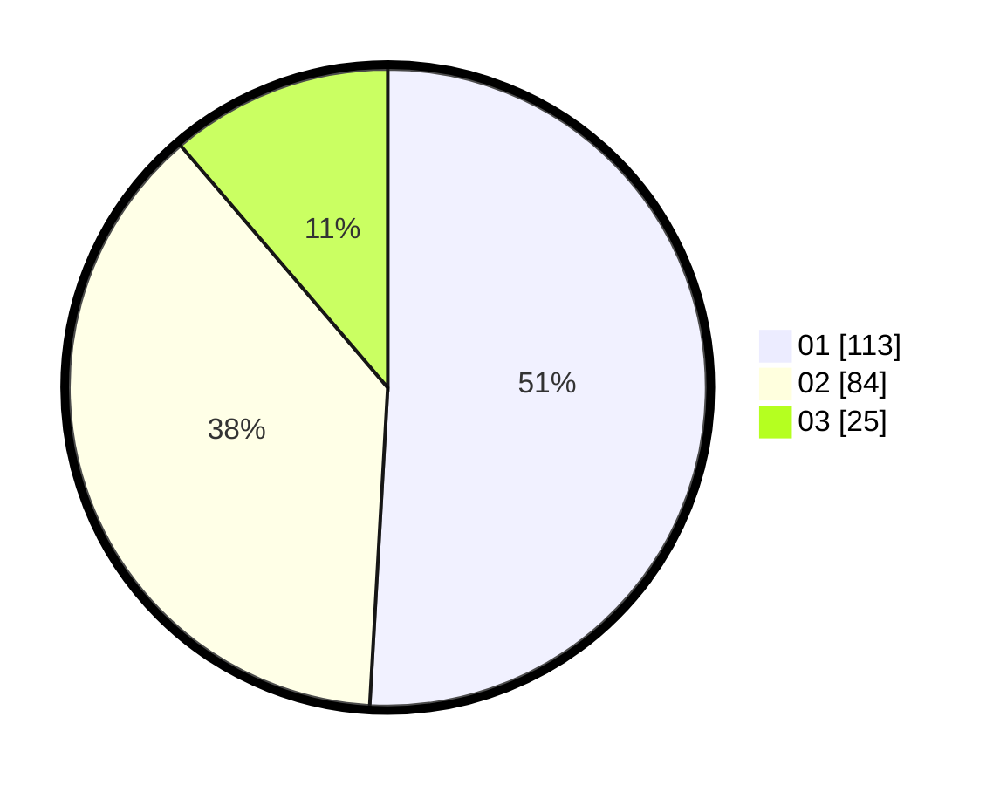

# Hasil

Hasil perolehan suara paslon dapat dilihat pada file paslon-01.txt, paslon-02.txt, dan paslon-03.txt.

Jika tidak ada, artinya data tersebut belum ada pada SIREKAP.

## Perolehan Suara

 * Paslon 01: **113**.
 * Paslon 02: **84**.
 * Paslon 03: **25**.

## Foto C Plano

https://sirekap-obj-formc.kpu.go.id/e48d/pemilu/ppwp/31/75/08/10/05/3175081005006-20240214-155335--ceb7cb65-ba6e-46bf-a164-1c6c2fa36821.jpg

https://sirekap-obj-formc.kpu.go.id/e48d/pemilu/ppwp/31/75/08/10/05/3175081005006-20240214-155329--b0c746fd-c49b-4c22-847e-39292b9cfbdc.jpg

https://sirekap-obj-formc.kpu.go.id/e48d/pemilu/ppwp/31/75/08/10/05/3175081005006-20240214-155322--c1ef8a19-8c5d-45c6-9054-f17a38eb5ef1.jpg
