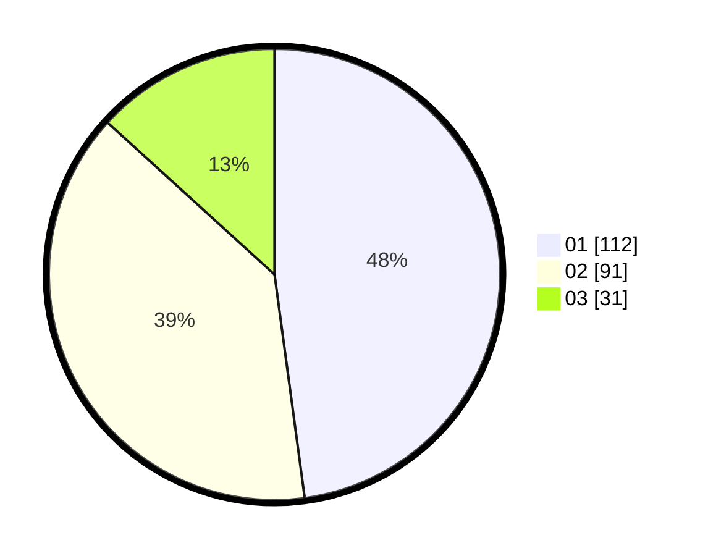

# Hasil

Hasil perolehan suara paslon dapat dilihat pada file paslon-01.txt, paslon-02.txt, dan paslon-03.txt.

Jika tidak ada, artinya data tersebut belum ada pada SIREKAP.

## Perolehan Suara

 * Paslon 01: **112**.
 * Paslon 02: **91**.
 * Paslon 03: **31**.

## Foto C Plano

https://sirekap-obj-formc.kpu.go.id/21fb/pemilu/ppwp/31/75/08/10/05/3175081005007-20240214-191920--8f063228-d357-4afa-a9c0-982683365965.jpg

https://sirekap-obj-formc.kpu.go.id/21fb/pemilu/ppwp/31/75/08/10/05/3175081005007-20240214-191641--b7c97ff5-4dfb-441c-b277-04fd713e7916.jpg

https://sirekap-obj-formc.kpu.go.id/21fb/pemilu/ppwp/31/75/08/10/05/3175081005007-20240214-192251--a5956bb2-9c4d-4d2d-80a7-7baa0b70c9ec.jpg

## DATA PEMILIH TETAP

Jumlah pemilih dalam DPT: **294**.
 * L: **148**.
 * P: **146**.

## DATA PENGGUNA HAK PILIH

Jumlah pengguna hak pilih dalam DPT: **232**.
 * L: **111**.
 * P: **121**.

Jumlah pengguna hak pilih dalam DPTb: **0**.
 * L: **0**.
 * P: **0**.

Jumlah pengguna hak pilih dalam DPK: **3**.
 * L: **2**.
 * P: **1**.

Jumlah pengguna hak pilih: **235**.
 * L: **113**.
 * P: **122**.

## JUMLAH SUARA SAH DAN TIDAK SAH

JUMLAH SELURUH SUARA SAH: **234**.

JUMLAH SUARA TIDAK SAH: **1**.

JUMLAH SELURUH SUARA SAH DAN SUARA TIDAK SAH: **235**.
