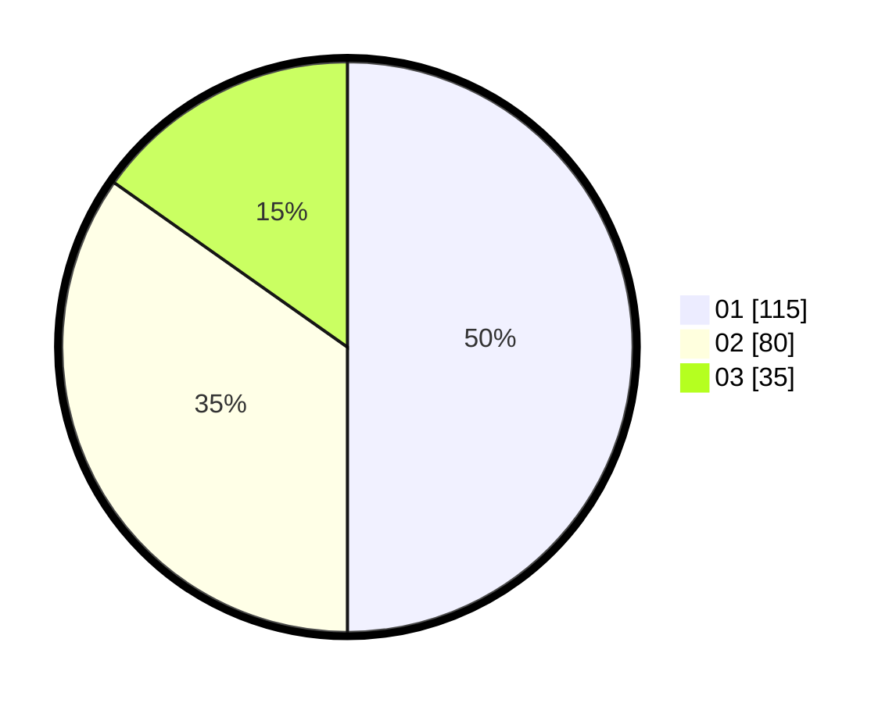

# Hasil

Hasil perolehan suara paslon dapat dilihat pada file paslon-01.txt, paslon-02.txt, dan paslon-03.txt.

Jika tidak ada, artinya data tersebut belum ada pada SIREKAP.

## Perolehan Suara

 * Paslon 01: **115**.
 * Paslon 02: **80**.
 * Paslon 03: **35**.

## Foto C Plano

https://sirekap-obj-formc.kpu.go.id/528e/pemilu/ppwp/31/75/08/10/05/3175081005009-20240215-190745--0522bfc4-ae7a-467a-a525-f39f855ef136.jpg

https://sirekap-obj-formc.kpu.go.id/528e/pemilu/ppwp/31/75/08/10/05/3175081005009-20240215-003047--89dfe863-0d08-4a3d-983b-34711d85982a.jpg

https://sirekap-obj-formc.kpu.go.id/528e/pemilu/ppwp/31/75/08/10/05/3175081005009-20240215-003238--1b33a6d8-782d-4a08-a85d-a2c4e3bede48.jpg
