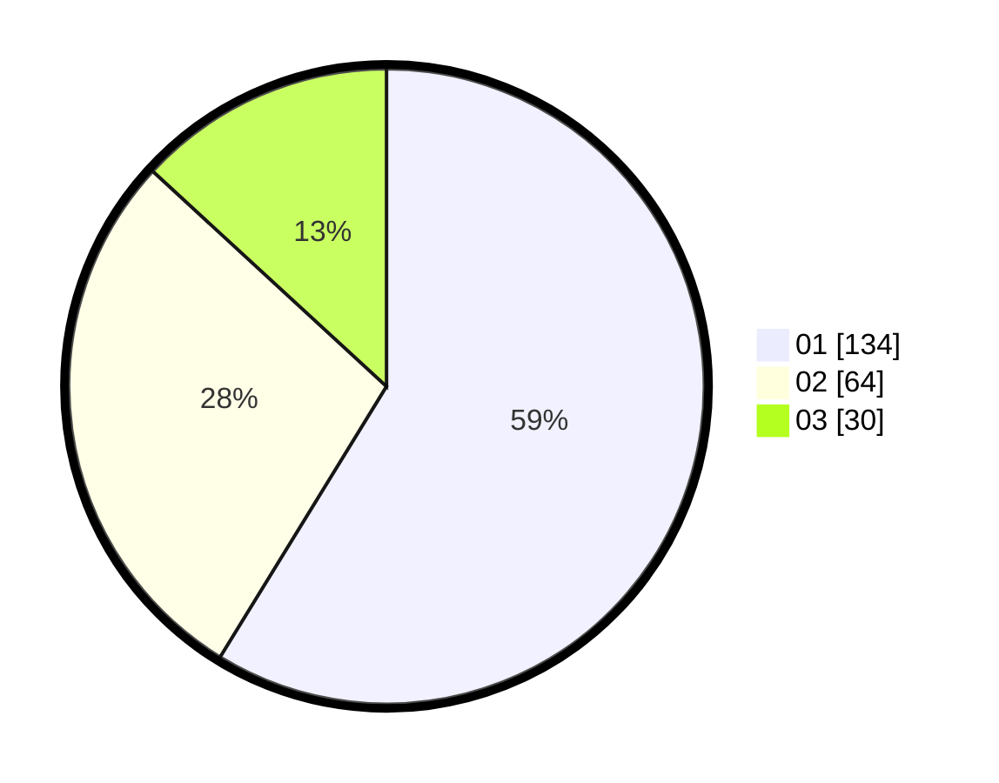

# Hasil

Hasil perolehan suara paslon dapat dilihat pada file paslon-01.txt, paslon-02.txt, dan paslon-03.txt.

Jika tidak ada, artinya data tersebut belum ada pada SIREKAP.

## Perolehan Suara

 * Paslon 01: **134**.
 * Paslon 02: **64**.
 * Paslon 03: **30**.

## Foto C Plano

https://sirekap-obj-formc.kpu.go.id/a83b/pemilu/ppwp/31/75/08/10/05/3175081005010-20240215-000809--4a99dca0-d0aa-4e02-8f58-db4bc2131b95.jpg

https://sirekap-obj-formc.kpu.go.id/a83b/pemilu/ppwp/31/75/08/10/05/3175081005010-20240215-001011--82b6a639-2a5b-4098-aa18-0aae28a83167.jpg

https://sirekap-obj-formc.kpu.go.id/a83b/pemilu/ppwp/31/75/08/10/05/3175081005010-20240215-001059--16e8ba60-2c3a-4512-b6e5-e41b2aade6d6.jpg
