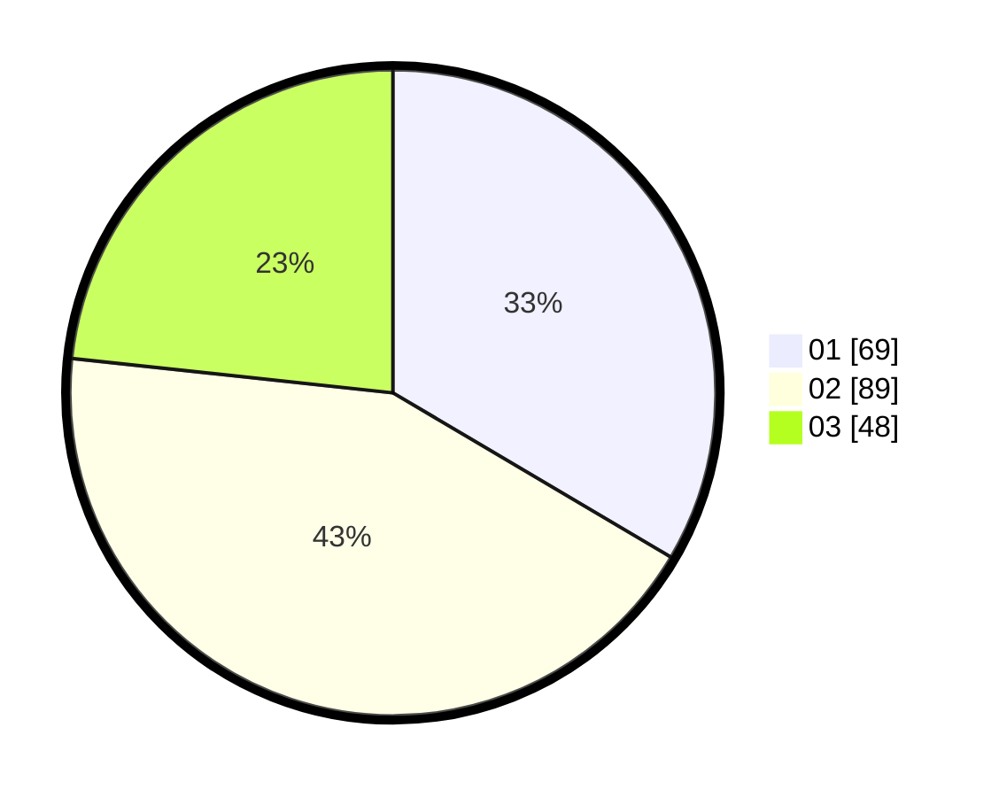

# Hasil

Hasil perolehan suara paslon dapat dilihat pada file paslon-01.txt, paslon-02.txt, dan paslon-03.txt.

Jika tidak ada, artinya data tersebut belum ada pada SIREKAP.

## Perolehan Suara

 * Paslon 01: **69**.
 * Paslon 02: **89**.
 * Paslon 03: **48**.

## Foto C Plano

https://sirekap-obj-formc.kpu.go.id/a12b/pemilu/ppwp/31/75/08/10/05/3175081005011-20240215-023149--b275fdcb-3a29-4625-bc5a-ed4be2943830.jpg

https://sirekap-obj-formc.kpu.go.id/a12b/pemilu/ppwp/31/75/08/10/05/3175081005011-20240214-220445--fe12f6c1-2574-4fec-8714-73ebf23a7d9e.jpg

https://sirekap-obj-formc.kpu.go.id/a12b/pemilu/ppwp/31/75/08/10/05/3175081005011-20240214-220545--546e8cfe-d3b0-4a59-ba82-e84cb2a8c0df.jpg

## DATA PEMILIH TETAP

Jumlah pemilih dalam DPT: **271**.
 * L: **141**.
 * P: **130**.

## DATA PENGGUNA HAK PILIH

Jumlah pengguna hak pilih dalam DPT: **215**.
 * L: **109**.
 * P: **106**.

Jumlah pengguna hak pilih dalam DPTb: **0**.
 * L: **0**.
 * P: **0**.

Jumlah pengguna hak pilih dalam DPK: **0**.
 * L: **0**.
 * P: **0**.

Jumlah pengguna hak pilih: **215**.
 * L: **109**.
 * P: **106**.

## JUMLAH SUARA SAH DAN TIDAK SAH

JUMLAH SELURUH SUARA SAH: **206**.

JUMLAH SUARA TIDAK SAH: **9**.

JUMLAH SELURUH SUARA SAH DAN SUARA TIDAK SAH: **215**.
