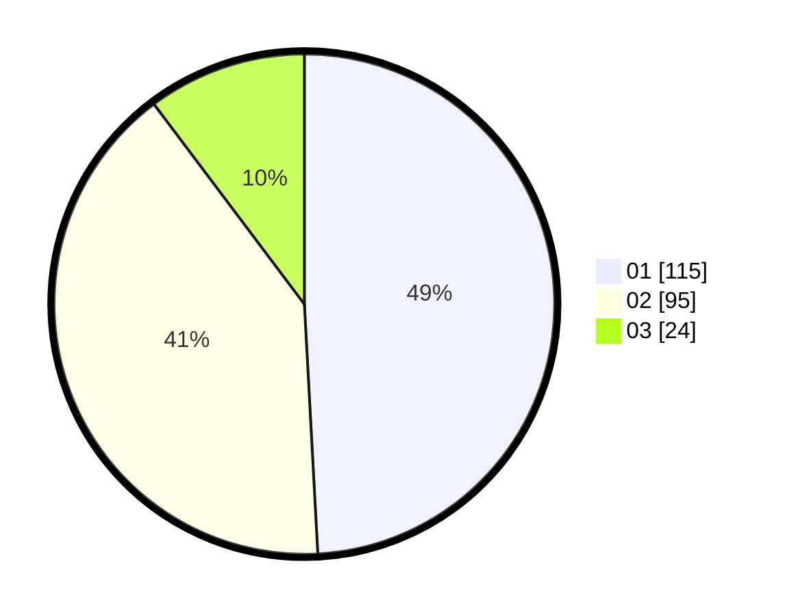

# Hasil

Hasil perolehan suara paslon dapat dilihat pada file paslon-01.txt, paslon-02.txt, dan paslon-03.txt.

Jika tidak ada, artinya data tersebut belum ada pada SIREKAP.

## Perolehan Suara

 * Paslon 01: **115**.
 * Paslon 02: **95**.
 * Paslon 03: **24**.

## Foto C Plano

https://sirekap-obj-formc.kpu.go.id/4482/pemilu/ppwp/31/75/08/10/05/3175081005013-20240214-210205--22b99d89-5074-4592-b963-e9a136e66a37.jpg

https://sirekap-obj-formc.kpu.go.id/4482/pemilu/ppwp/31/75/08/10/05/3175081005013-20240214-225347--6cd5d725-a0b4-4a3e-92bf-e8909f49933e.jpg

https://sirekap-obj-formc.kpu.go.id/4482/pemilu/ppwp/31/75/08/10/05/3175081005013-20240214-225822--c85ca4c3-4c42-433a-aa47-dba02b41d6a6.jpg

## DATA PEMILIH TETAP

Jumlah pemilih dalam DPT: **270**.
 * L: **131**.
 * P: **139**.

## DATA PENGGUNA HAK PILIH

Jumlah pengguna hak pilih dalam DPT: **235**.
 * L: **111**.
 * P: **124**.

Jumlah pengguna hak pilih dalam DPTb: **2**.
 * L: **1**.
 * P: **1**.

Jumlah pengguna hak pilih dalam DPK: **2**.
 * L: **1**.
 * P: **1**.

Jumlah pengguna hak pilih: **239**.
 * L: **113**.
 * P: **126**.

## JUMLAH SUARA SAH DAN TIDAK SAH

JUMLAH SELURUH SUARA SAH: **234**.

JUMLAH SUARA TIDAK SAH: **5**.

JUMLAH SELURUH SUARA SAH DAN SUARA TIDAK SAH: **239**.
