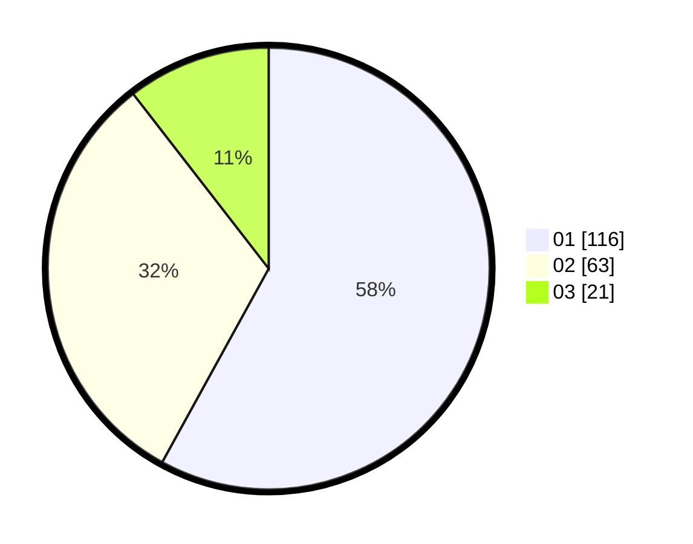

# Hasil

Hasil perolehan suara paslon dapat dilihat pada file paslon-01.txt, paslon-02.txt, dan paslon-03.txt.

Jika tidak ada, artinya data tersebut belum ada pada SIREKAP.

## Perolehan Suara

 * Paslon 01: **116**.
 * Paslon 02: **63**.
 * Paslon 03: **21**.

## Foto C Plano

https://sirekap-obj-formc.kpu.go.id/0db8/pemilu/ppwp/31/75/08/10/05/3175081005016-20240214-185511--aff62f74-b25a-4934-b443-e66e95200e14.jpg

https://sirekap-obj-formc.kpu.go.id/0db8/pemilu/ppwp/31/75/08/10/05/3175081005016-20240214-190445--61985cd0-c3cf-4812-a1ba-55d62a099f39.jpg

https://sirekap-obj-formc.kpu.go.id/0db8/pemilu/ppwp/31/75/08/10/05/3175081005016-20240214-203306--290959d6-e30b-4255-82af-5a7af7d78d9a.jpg

## DATA PEMILIH TETAP

Jumlah pemilih dalam DPT: **269**.
 * L: **129**.
 * P: **140**.

## DATA PENGGUNA HAK PILIH

Jumlah pengguna hak pilih dalam DPT: **201**.
 * L: **94**.
 * P: **107**.

Jumlah pengguna hak pilih dalam DPTb: **0**.
 * L: **0**.
 * P: **0**.

Jumlah pengguna hak pilih dalam DPK: **0**.
 * L: **0**.
 * P: **0**.

Jumlah pengguna hak pilih: **201**.
 * L: **94**.
 * P: **107**.

## JUMLAH SUARA SAH DAN TIDAK SAH

JUMLAH SELURUH SUARA SAH: **200**.

JUMLAH SUARA TIDAK SAH: **1**.

JUMLAH SELURUH SUARA SAH DAN SUARA TIDAK SAH: **201**.
