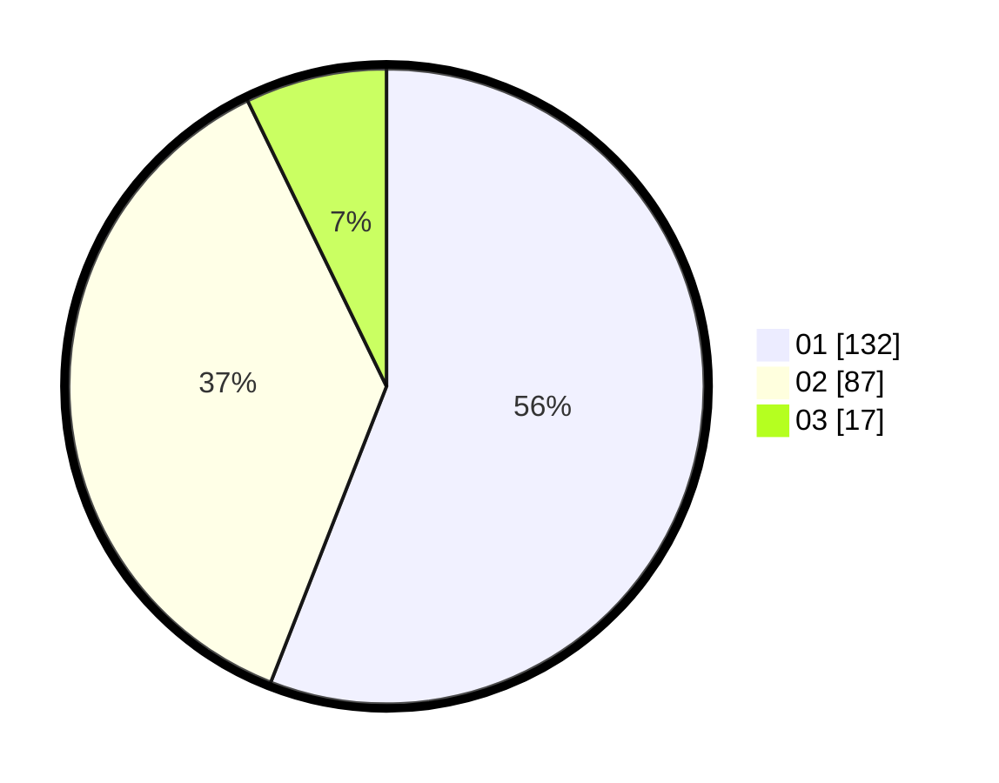

# Hasil

Hasil perolehan suara paslon dapat dilihat pada file paslon-01.txt, paslon-02.txt, dan paslon-03.txt.

Jika tidak ada, artinya data tersebut belum ada pada SIREKAP.

## Perolehan Suara

 * Paslon 01: **132**.
 * Paslon 02: **87**.
 * Paslon 03: **17**.

## Foto C Plano

https://sirekap-obj-formc.kpu.go.id/d685/pemilu/ppwp/31/75/08/10/05/3175081005025-20240214-195454--93025834-29c3-45ef-967a-a8b315d48391.jpg

https://sirekap-obj-formc.kpu.go.id/d685/pemilu/ppwp/31/75/08/10/05/3175081005025-20240214-195458--ca7e6853-6f35-4d25-b172-d56aebcb8254.jpg

https://sirekap-obj-formc.kpu.go.id/d685/pemilu/ppwp/31/75/08/10/05/3175081005025-20240214-195503--d55d18f5-b55e-40db-b4bd-f78af08c3931.jpg

## DATA PEMILIH TETAP

Jumlah pemilih dalam DPT: **288**.
 * L: **148**.
 * P: **140**.

## DATA PENGGUNA HAK PILIH

Jumlah pengguna hak pilih dalam DPT: **236**.
 * L: **117**.
 * P: **119**.

Jumlah pengguna hak pilih dalam DPTb: **0**.
 * L: **0**.
 * P: **0**.

Jumlah pengguna hak pilih dalam DPK: **1**.
 * L: **0**.
 * P: **1**.

Jumlah pengguna hak pilih: **237**.
 * L: **117**.
 * P: **120**.

## JUMLAH SUARA SAH DAN TIDAK SAH

JUMLAH SELURUH SUARA SAH: **236**.

JUMLAH SUARA TIDAK SAH: **1**.

JUMLAH SELURUH SUARA SAH DAN SUARA TIDAK SAH: **237**.
