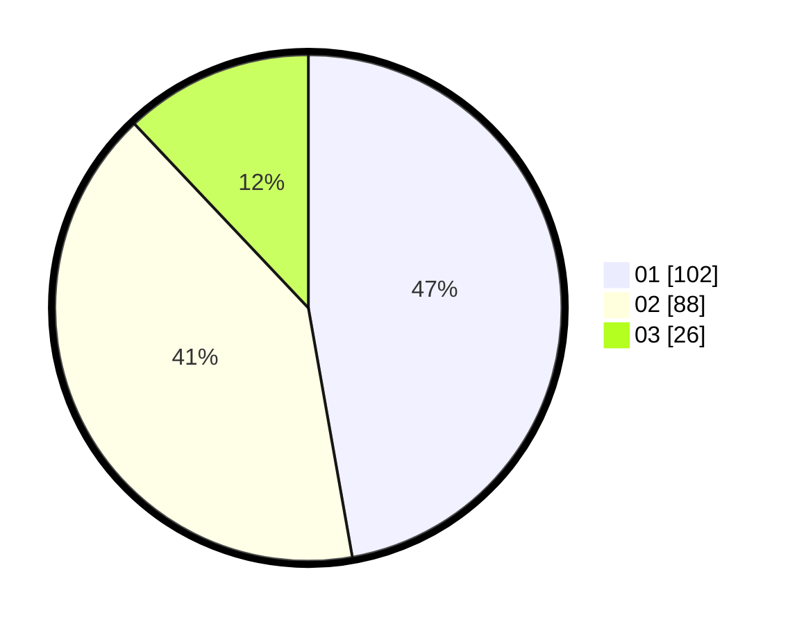

# Hasil

Hasil perolehan suara paslon dapat dilihat pada file paslon-01.txt, paslon-02.txt, dan paslon-03.txt.

Jika tidak ada, artinya data tersebut belum ada pada SIREKAP.

## Perolehan Suara

 * Paslon 01: **102**.
 * Paslon 02: **88**.
 * Paslon 03: **26**.

## Foto C Plano

https://sirekap-obj-formc.kpu.go.id/2c12/pemilu/ppwp/31/75/08/10/05/3175081005026-20240214-194731--db3b5d11-8052-48f1-b667-51025feec665.jpg

https://sirekap-obj-formc.kpu.go.id/2c12/pemilu/ppwp/31/75/08/10/05/3175081005026-20240214-194908--8f590fc8-778d-4cbd-8edb-027d849f9540.jpg

https://sirekap-obj-formc.kpu.go.id/2c12/pemilu/ppwp/31/75/08/10/05/3175081005026-20240214-195019--6dcc1215-5832-4f4c-ad26-97602e39923b.jpg

## DATA PEMILIH TETAP

Jumlah pemilih dalam DPT: **271**.
 * L: **140**.
 * P: **131**.

## DATA PENGGUNA HAK PILIH

Jumlah pengguna hak pilih dalam DPT: **218**.
 * L: **107**.
 * P: **111**.

Jumlah pengguna hak pilih dalam DPTb: **0**.
 * L: **0**.
 * P: **0**.

Jumlah pengguna hak pilih dalam DPK: **2**.
 * L: **1**.
 * P: **1**.

Jumlah pengguna hak pilih: **220**.
 * L: **108**.
 * P: **112**.

## JUMLAH SUARA SAH DAN TIDAK SAH

JUMLAH SELURUH SUARA SAH: **216**.

JUMLAH SUARA TIDAK SAH: **4**.

JUMLAH SELURUH SUARA SAH DAN SUARA TIDAK SAH: **220**.
