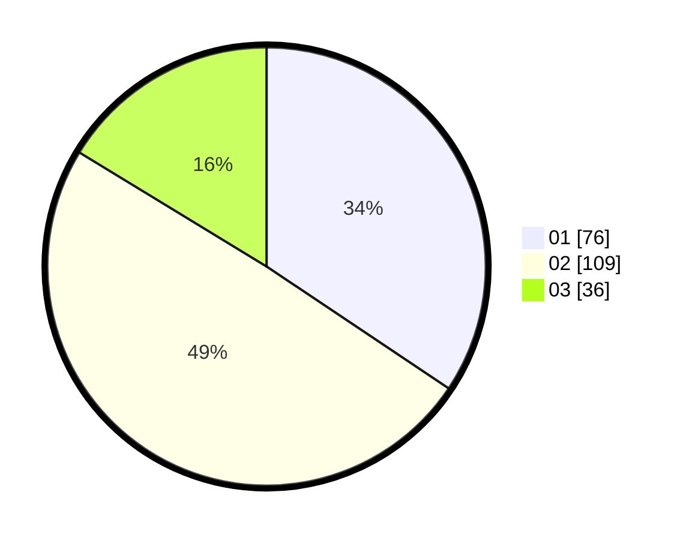

# Hasil

Hasil perolehan suara paslon dapat dilihat pada file paslon-01.txt, paslon-02.txt, dan paslon-03.txt.

Jika tidak ada, artinya data tersebut belum ada pada SIREKAP.

## Perolehan Suara

 * Paslon 01: **76**.
 * Paslon 02: **109**.
 * Paslon 03: **36**.

## Foto C Plano

https://sirekap-obj-formc.kpu.go.id/9c57/pemilu/ppwp/31/75/08/10/05/3175081005031-20240215-002743--f10b6dfb-6518-4a66-8c26-f60ba1297ef2.jpg

https://sirekap-obj-formc.kpu.go.id/9c57/pemilu/ppwp/31/75/08/10/05/3175081005031-20240215-024035--484d72f4-7ec5-4c3b-bcae-8de8441ac235.jpg

https://sirekap-obj-formc.kpu.go.id/9c57/pemilu/ppwp/31/75/08/10/05/3175081005031-20240215-003055--0613451b-aa49-426b-9392-c9ec71fd9ebe.jpg
