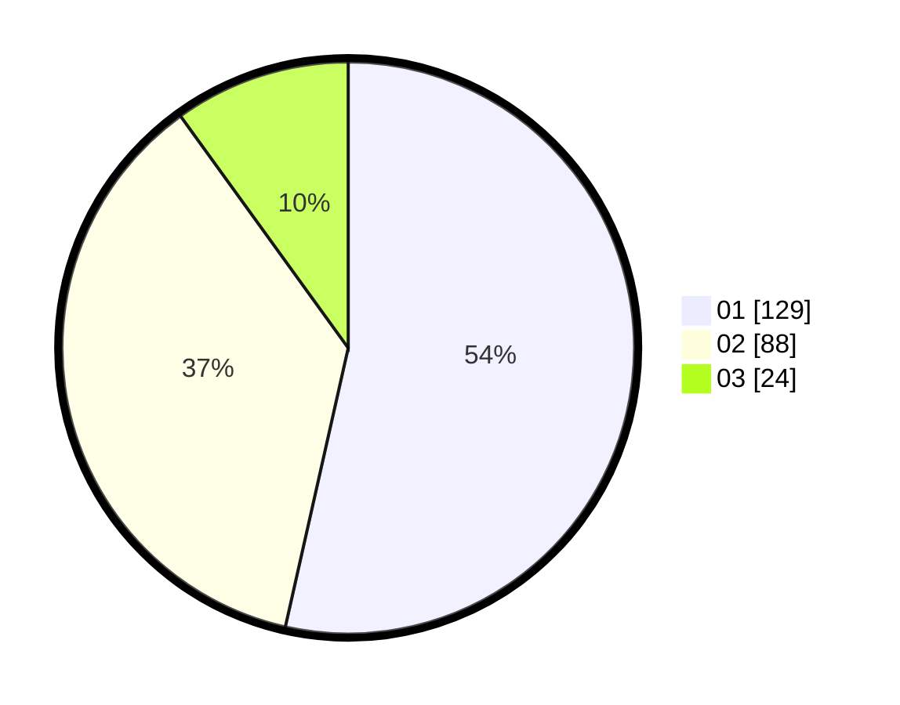

# Hasil

Hasil perolehan suara paslon dapat dilihat pada file paslon-01.txt, paslon-02.txt, dan paslon-03.txt.

Jika tidak ada, artinya data tersebut belum ada pada SIREKAP.

## Perolehan Suara

 * Paslon 01: **129**.
 * Paslon 02: **88**.
 * Paslon 03: **24**.

## Foto C Plano

https://sirekap-obj-formc.kpu.go.id/3063/pemilu/ppwp/31/75/08/10/05/3175081005041-20240216-033952--d037b880-7e8c-4785-b943-b9003c5c77e5.jpg

https://sirekap-obj-formc.kpu.go.id/3063/pemilu/ppwp/31/75/08/10/05/3175081005041-20240214-185349--4bfc8f87-43b2-47b2-a049-5fffd5b1ceb9.jpg

https://sirekap-obj-formc.kpu.go.id/3063/pemilu/ppwp/31/75/08/10/05/3175081005041-20240214-185252--4aaf5128-ac0a-40f1-a13b-a89e670ae0d3.jpg

## DATA PEMILIH TETAP

Jumlah pemilih dalam DPT: **294**.
 * L: **143**.
 * P: **151**.

## DATA PENGGUNA HAK PILIH

Jumlah pengguna hak pilih dalam DPT: **243**.
 * L: **112**.
 * P: **131**.

Jumlah pengguna hak pilih dalam DPTb: **0**.
 * L: **0**.
 * P: **0**.

Jumlah pengguna hak pilih dalam DPK: **0**.
 * L: **0**.
 * P: **0**.

Jumlah pengguna hak pilih: **243**.
 * L: **112**.
 * P: **131**.

## JUMLAH SUARA SAH DAN TIDAK SAH

JUMLAH SELURUH SUARA SAH: **241**.

JUMLAH SUARA TIDAK SAH: **2**.

JUMLAH SELURUH SUARA SAH DAN SUARA TIDAK SAH: **243**.
