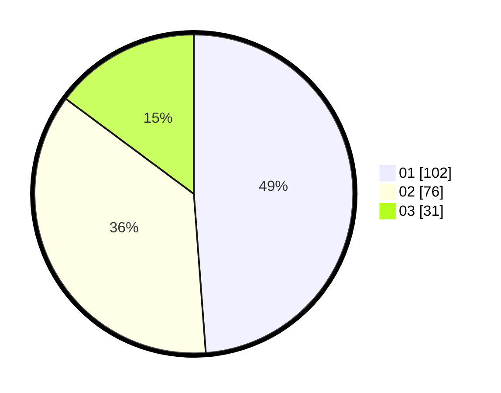

# Hasil

Hasil perolehan suara paslon dapat dilihat pada file paslon-01.txt, paslon-02.txt, dan paslon-03.txt.

Jika tidak ada, artinya data tersebut belum ada pada SIREKAP.

## Perolehan Suara

 * Paslon 01: **102**.
 * Paslon 02: **76**.
 * Paslon 03: **31**.

## Foto C Plano

https://sirekap-obj-formc.kpu.go.id/c805/pemilu/ppwp/31/75/08/10/05/3175081005044-20240214-155101--7366d9e1-a9de-40e3-b62c-f8df26b9848a.jpg

https://sirekap-obj-formc.kpu.go.id/c805/pemilu/ppwp/31/75/08/10/05/3175081005044-20240214-155052--79510a26-fc81-4f75-aa11-4fcd5d13f027.jpg

https://sirekap-obj-formc.kpu.go.id/c805/pemilu/ppwp/31/75/08/10/05/3175081005044-20240214-155136--77ce9648-5bee-4b58-a3c2-9ca7cfed9907.jpg

## DATA PEMILIH TETAP

Jumlah pemilih dalam DPT: **257**.
 * L: **135**.
 * P: **122**.

## DATA PENGGUNA HAK PILIH

Jumlah pengguna hak pilih dalam DPT: **211**.
 * L: **111**.
 * P: **100**.

Jumlah pengguna hak pilih dalam DPTb: **0**.
 * L: **0**.
 * P: **0**.

Jumlah pengguna hak pilih dalam DPK: **0**.
 * L: **0**.
 * P: **0**.

Jumlah pengguna hak pilih: **211**.
 * L: **111**.
 * P: **100**.

## JUMLAH SUARA SAH DAN TIDAK SAH

JUMLAH SELURUH SUARA SAH: **209**.

JUMLAH SUARA TIDAK SAH: **3**.

JUMLAH SELURUH SUARA SAH DAN SUARA TIDAK SAH: **212**.
