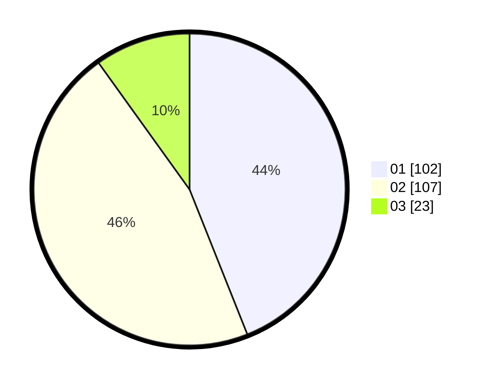

# Hasil

Hasil perolehan suara paslon dapat dilihat pada file paslon-01.txt, paslon-02.txt, dan paslon-03.txt.

Jika tidak ada, artinya data tersebut belum ada pada SIREKAP.

## Perolehan Suara

 * Paslon 01: **102**.
 * Paslon 02: **107**.
 * Paslon 03: **23**.

## Foto C Plano

https://sirekap-obj-formc.kpu.go.id/fa3f/pemilu/ppwp/31/75/08/10/05/3175081005047-20240215-015328--62a738c1-2c1b-4467-9d8d-4d09f64abc18.jpg

https://sirekap-obj-formc.kpu.go.id/fa3f/pemilu/ppwp/31/75/08/10/05/3175081005047-20240215-015713--3d7fcf51-7f11-4255-9c42-a03843ce419c.jpg

https://sirekap-obj-formc.kpu.go.id/fa3f/pemilu/ppwp/31/75/08/10/05/3175081005047-20240215-015959--a84aac9b-fbe0-4760-a6fc-6d1aad104cfd.jpg
