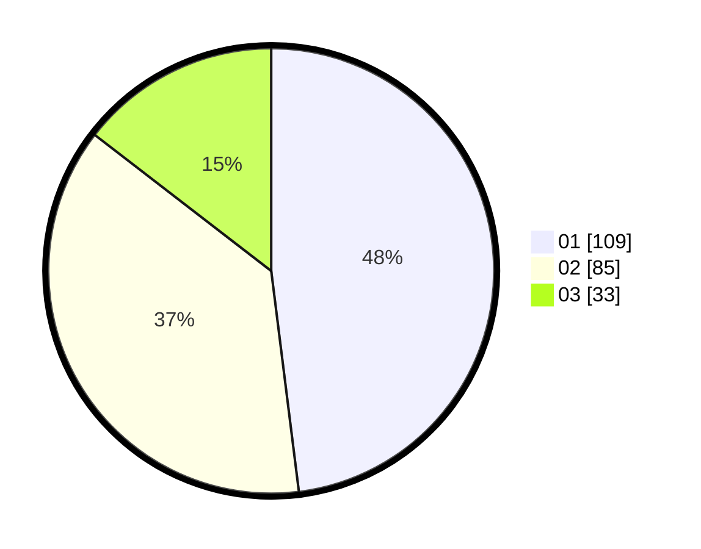

# Hasil

Hasil perolehan suara paslon dapat dilihat pada file paslon-01.txt, paslon-02.txt, dan paslon-03.txt.

Jika tidak ada, artinya data tersebut belum ada pada SIREKAP.

## Perolehan Suara

 * Paslon 01: **109**.
 * Paslon 02: **85**.
 * Paslon 03: **33**.

## Foto C Plano

https://sirekap-obj-formc.kpu.go.id/b0d5/pemilu/ppwp/31/75/08/10/05/3175081005052-20240214-234907--afefc09d-38ff-4cfd-a110-a8fa849ea93b.jpg

https://sirekap-obj-formc.kpu.go.id/b0d5/pemilu/ppwp/31/75/08/10/05/3175081005052-20240214-234918--1f193580-0165-40bc-91b4-c45c3df4b889.jpg

https://sirekap-obj-formc.kpu.go.id/b0d5/pemilu/ppwp/31/75/08/10/05/3175081005052-20240214-234929--4bf8ee4a-e82f-4e74-8581-53dd24de3a26.jpg

## DATA PEMILIH TETAP

Jumlah pemilih dalam DPT: **256**.
 * L: **120**.
 * P: **136**.

## DATA PENGGUNA HAK PILIH

Jumlah pengguna hak pilih dalam DPT: **224**.
 * L: **102**.
 * P: **122**.

Jumlah pengguna hak pilih dalam DPTb: **3**.
 * L: **3**.
 * P: **0**.

Jumlah pengguna hak pilih dalam DPK: **5**.
 * L: **2**.
 * P: **3**.

Jumlah pengguna hak pilih: **232**.
 * L: **107**.
 * P: **125**.

## JUMLAH SUARA SAH DAN TIDAK SAH

JUMLAH SELURUH SUARA SAH: **227**.

JUMLAH SUARA TIDAK SAH: **5**.

JUMLAH SELURUH SUARA SAH DAN SUARA TIDAK SAH: **232**.
