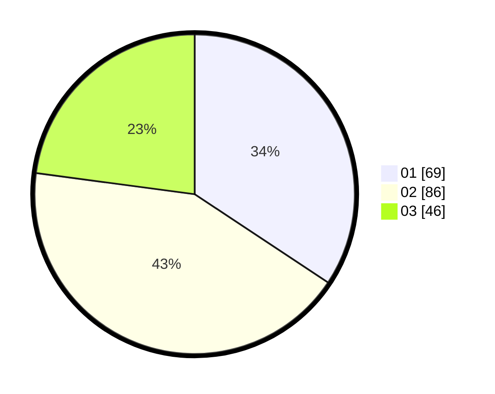

# Hasil

Hasil perolehan suara paslon dapat dilihat pada file paslon-01.txt, paslon-02.txt, dan paslon-03.txt.

Jika tidak ada, artinya data tersebut belum ada pada SIREKAP.

## Perolehan Suara

 * Paslon 01: **69**.
 * Paslon 02: **86**.
 * Paslon 03: **46**.

## Foto C Plano

https://sirekap-obj-formc.kpu.go.id/44af/pemilu/ppwp/31/75/08/10/05/3175081005053-20240214-155151--d6b430b7-4d32-479e-b8b5-3d0db5093301.jpg

https://sirekap-obj-formc.kpu.go.id/44af/pemilu/ppwp/31/75/08/10/05/3175081005053-20240214-155200--639e0fa5-daad-4c95-be63-f5b776766480.jpg

https://sirekap-obj-formc.kpu.go.id/44af/pemilu/ppwp/31/75/08/10/05/3175081005053-20240214-155205--9e83dfe7-429d-4528-b912-0f6e02979b72.jpg

## DATA PEMILIH TETAP

Jumlah pemilih dalam DPT: **268**.
 * L: **131**.
 * P: **137**.

## DATA PENGGUNA HAK PILIH

Jumlah pengguna hak pilih dalam DPT: **202**.
 * L: **84**.
 * P: **118**.

Jumlah pengguna hak pilih dalam DPTb: **3**.
 * L: **1**.
 * P: **2**.

Jumlah pengguna hak pilih dalam DPK: **0**.
 * L: **0**.
 * P: **0**.

Jumlah pengguna hak pilih: **205**.
 * L: **85**.
 * P: **120**.

## JUMLAH SUARA SAH DAN TIDAK SAH

JUMLAH SELURUH SUARA SAH: **201**.

JUMLAH SUARA TIDAK SAH: **4**.

JUMLAH SELURUH SUARA SAH DAN SUARA TIDAK SAH: **205**.
